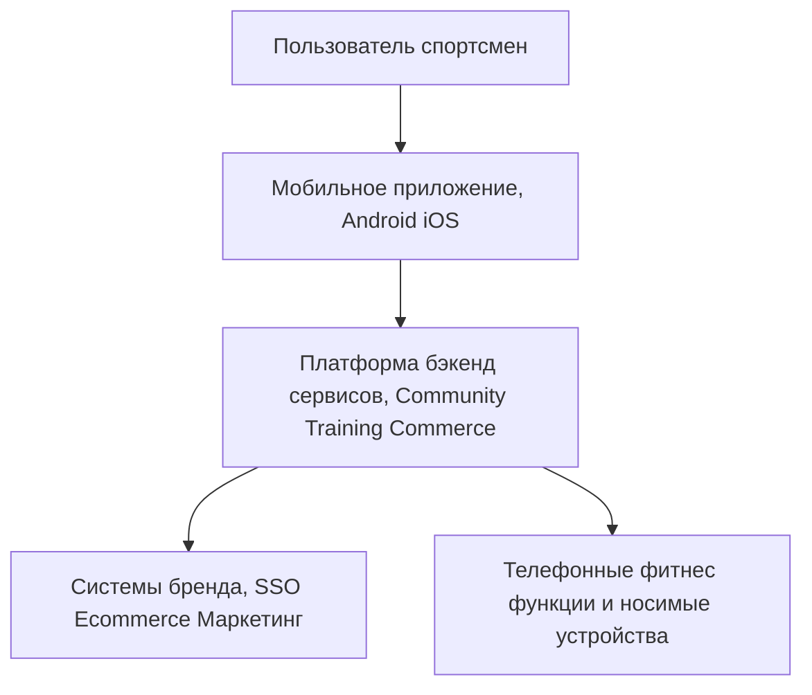
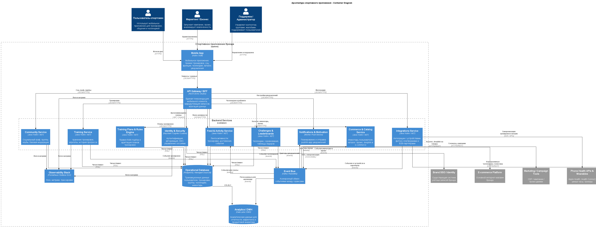

## 4. Разработка концептуальной архитектуры

### 4.1. Общий обзор

Концептуальная архитектура приложения опирается на четыре ключевые бизнес-цели:

1. Community‑first: глобальное спортивное сообщество вокруг бренда.  
2. Data/AI‑персонализация тренировок и мотивации.  
3. Commerce & экосистема: рост продаж и LTV через связанный опыт.  
4. Масштабируемая, безопасная глобальная платформа.

Система строится как облачно-нативная, многосервисная платформа, ориентированная на мобильных клиентов (iOS/Android) и интеграцию с существующей экосистемой компании (e‑commerce, учётная запись бренда, маркетинговые системы, партнёрские сервисы и устройства).

На концептуальном уровне выделяются следующие крупные подсистемы:

- Клиентские приложения (Mobile Clients).  
- API‑шлюз и слой BFF (Backend for Frontend).  
- Социальный контур (Community & Social).  
- Тренировочный контур и персонализация (Training & Personalization).  
- Коммерческий контур и интеграция с e‑commerce (Commerce & Ecosystem).  
- Интеграции с устройствами и внешними платформами (Devices & External Integrations).  
- Управление пользователями, безопасностью и доступом (Identity & Security).  
- Платформенные сервисы (Observability, конфигурация, очереди событий, хранилища).

### 4.2. Клиентские приложения

**Mobile Clients (iOS/Android)**  
- Отвечают за пользовательский интерфейс: лента активности, профиль, группы, челленджи, планы тренировок, каталог инвентаря, промо.  
- Выполняют локальную агрегацию данных с датчиков/fitness‑платформ телефона (в рамках разрешений).  
- Минимизируют бизнес-логику: основная часть правил и персонализации реализуется на серверной стороне.

### 4.3. API‑шлюз и Backend for Frontend (BFF)

**API Gateway / BFF слой**  
- Единая точка входа для мобильных клиентов, скрывающая внутреннюю структуру сервисов.  
- Отвечает за маршрутизацию запросов, аутентификацию токенов, агрегацию ответов от нескольких подсистем.  
- Реализует разные BFF‑эндпоинты под мобильные клиенты (и, при необходимости, админские/веб-интерфейсы).

### 4.4. Социальный контур (Community & Social)

**Community Service**  
- Управление социальным графом (друзья, подписки, блокировки).  
- Работа с группами и клубами: создание, управление участниками, базовые права.  

**Feed & Activity Service**  
- Хранение и выдача ленты активности (тренировки, достижения, вступление и результаты челленджей).  
- Простая по времени-сортированная выдача, без сложного ранжирования.

**Challenges & Leaderboards Service**  
- Управление челленджами: создание, правила, участие, статусы.  
- Расчёт результатов и формирование таблиц лидеров (персональных, групповых, региональных).  

**Social Interactions Service**  
- Реакции и комментарии.  
- Базовая модерация (жалобы, скрытие/блокировка контента и пользователей).

### 4.5. Тренировочный контур и персонализация

**Training Session Service**  
- Приём и хранение данных о тренировках (тип, длительность, дистанция, ключевые метрики).  
- Агрегаты по пользователю (неделя, месяц, персональные рекорды).

**User Profile & Goals Service**  
- Профиль в части тренировочных целей, уровня, предпочтительных активностей и доступного времени.  
- Управление целями и базовыми настройками для планов.

**Training Plans & Rules Engine**  
- Хранение шаблонов тренировочных планов под разные цели и уровни.  
- Rules‑based движок для подбора и адаптации планов на основе профиля и истории тренировок.  
- Формирование рекомендаций «тренировка на сегодня» и подсказок по восстановлению.

**Notifications & Motivation Service**  
- Планирование и отправка push/in‑app уведомлений (напоминания, поздравления, дайджесты).  
- Работа с сегментами пользователей (новички, возвращающиеся, высокоактивные) для персонализированных триггеров.

### 4.6. Коммерческий контур и экосистема

**Brand Identity & Loyalty Integration Service**  
- Интеграция с существующей брендовой учётной записью (SSO, профиль, статусы лояльности).  
- Синхронизация ключевых пользовательских атрибутов с внешними системами.

**User Gear / Inventory Service**  
- Хранение списка инвентаря пользователя (обувь, снаряжение, дата начала использования, связь с тренировками).  
- Расчёт пробега/использования и генерация событий о необходимости обновления.

**In‑App Catalog & Recommendation Connector**  
- Представление сокращённого каталога товаров внутри приложения, с фокусом на спортивные активности пользователя.  
- Интеграция с внешними системами рекомендаций/маркетинга бренда.  
- Формирование deeplink‑ссылок в основной e‑commerce.

**Promotions & Campaigns Service**  
- Управление промо‑вставками и кампаниями (регион, тип активности, сегмент пользователя).  
- Взаимодействие с маркетинговыми системами (DMP/CDP, кампании, отслеживание конверсий).

### 4.7. Интеграции с устройствами и внешними платформами

**Device & Health Integrations Service**  
- Интеграция с платформами телефонов (HealthKit / Health Connect и аналоги).  
- Поддержка подключений к популярным wearables через стандартизированные протоколы и API.  
- Нормализация и агрегация данных от различных источников в единую тренировочную модель.

**External Partners Integration**  
- Точки интеграции с корпоративными wellness‑платформами, организаторами мероприятий и B2B‑клиентами (корпоративные челленджи).  
- Возможность выгружать агрегированные статистики и результаты.

### 4.8. Управление пользователями и безопасность

**Identity & Access Management (IAM)**  
- Аутентификация пользователей (в том числе через брендовый SSO и соцсети).  
- Управление сессиями и устройствами.  
- Ролевое разграничение доступа (пользователь, администратор групп, модератор и т.д.).

**Privacy & Consent Management**  
- Хранение согласий на обработку персональных и health‑данных.  
- Настройки приватности профиля, тренировок, геоданных и участия в рейтингах.  
- Поддержка сценариев удаления и выгрузки данных пользователя.

### 4.9. Платформенные сервисы

**Event Bus / Messaging**  
- Асинхронный обмен событиями между подсистемами (создание тренировки, вступление в челлендж, достижение порога использования инвентаря и т.п.).  

**Data Storage & Analytics Layer**  
- Операционные хранилища для сервисов (OLTP).  
- Аналитическое хранилище/даталейк для отчётности, маркетинговой аналитики, продуктовых метрик.

**Observability (Logs, Metrics, Tracing)**  
- Централизованный сбор логов, метрик и трассировок.  
- Дашборды и алёрты по ключевым сервисам и бизнес‑метрикам.

### 4.10. Связь с атрибутами качества

- **Масштабируемость** обеспечивается разделением на независимые доменные сервисы, использованием асинхронных событий и горизонтально масштабируемых компонентов.  
- **Надёжность и доступность** достигаются за счёт дублирования критичных сервисов, изоляции отказов и механизмов graceful degradation (например, временное ограничение промо/ленты при пиках нагрузки).  
- **Безопасность и конфиденциальность** встроены через отдельный контур IAM, управление согласием, настройки приватности и минимизацию данных в каждом домене.

### 4.11. Верхнеуровневая архитектура

### 4.12. C4 диаграмма концептуальной архитектуры

[Назад](../README.md)