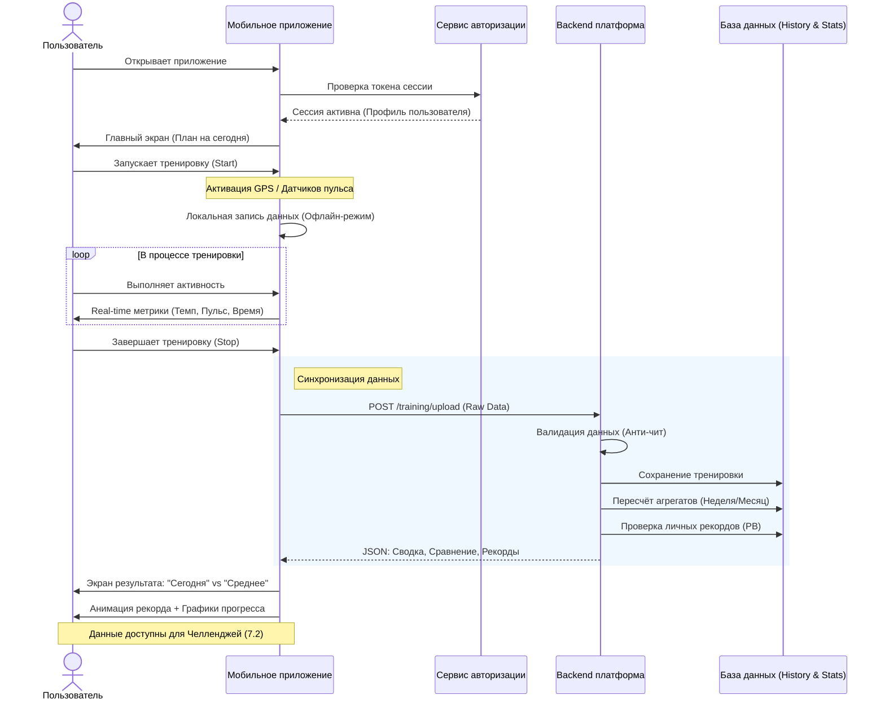
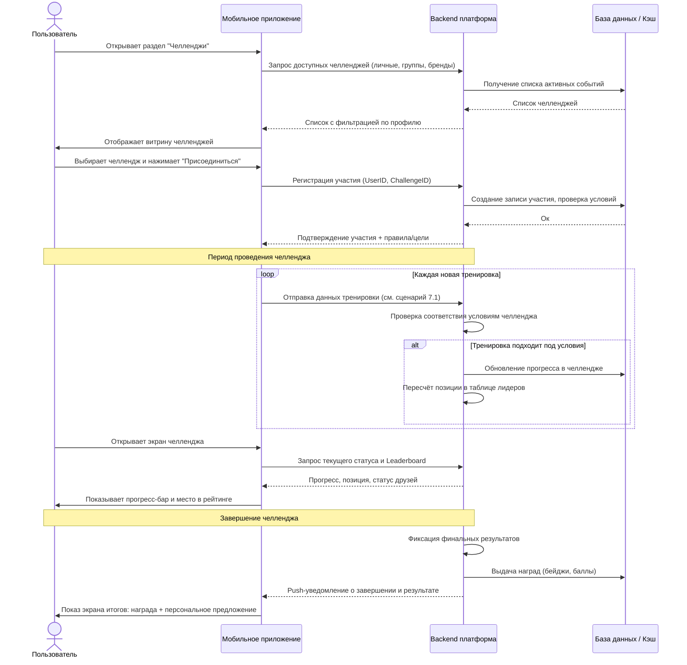
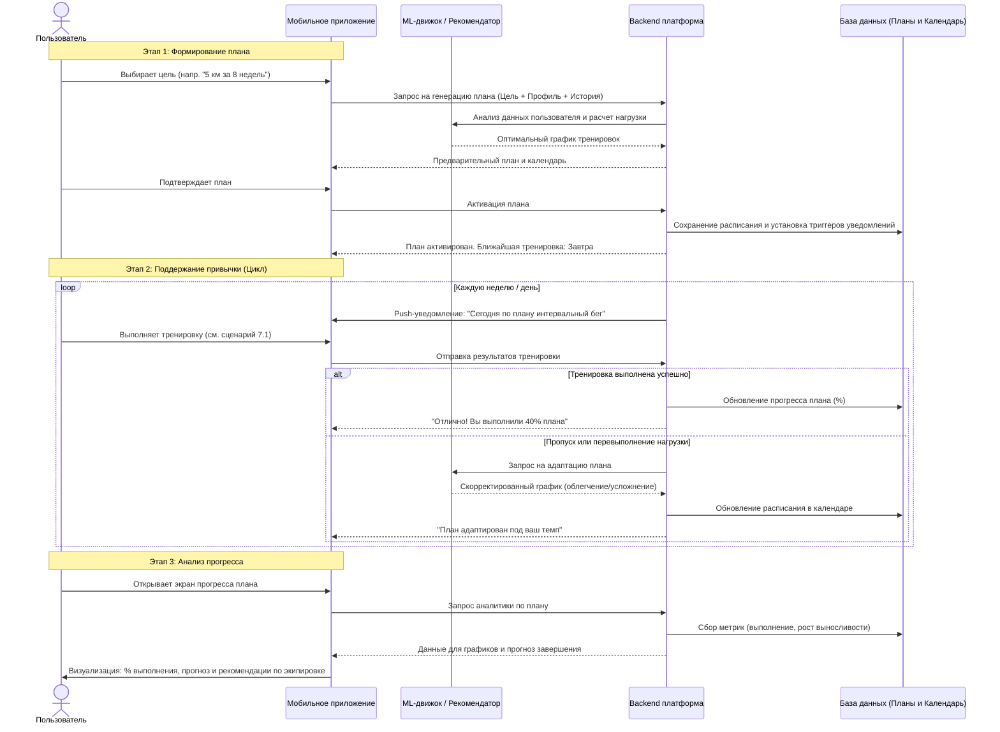
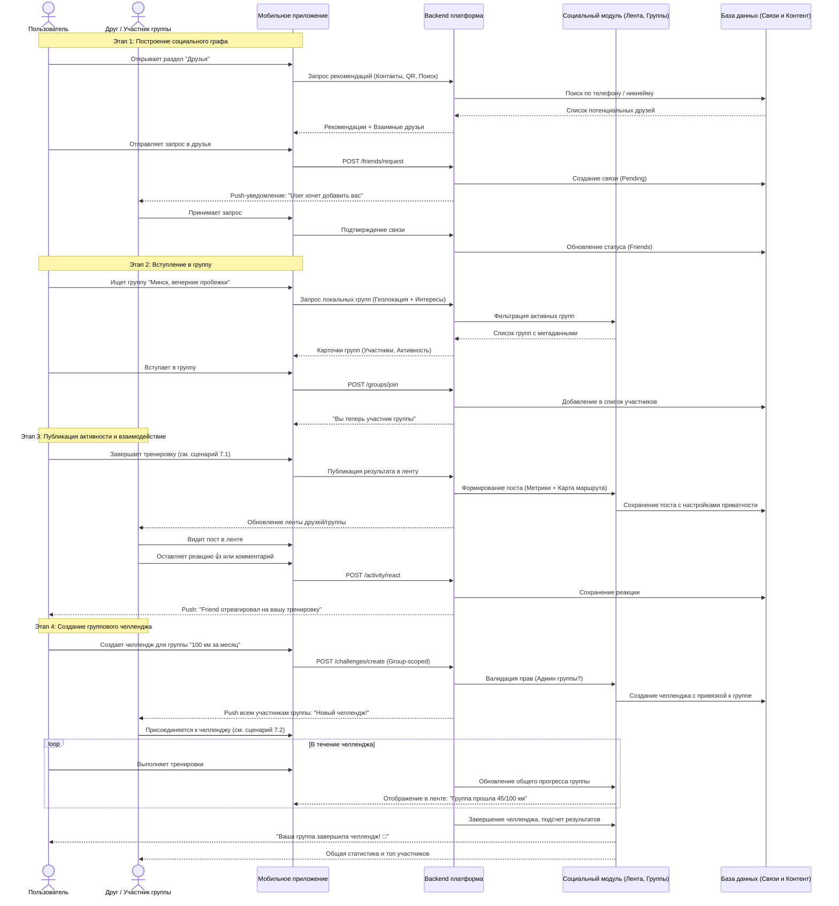
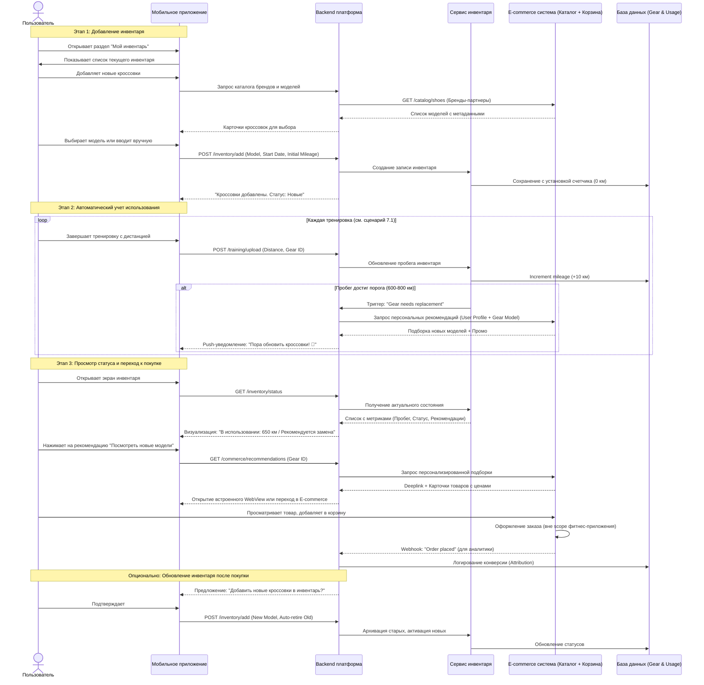
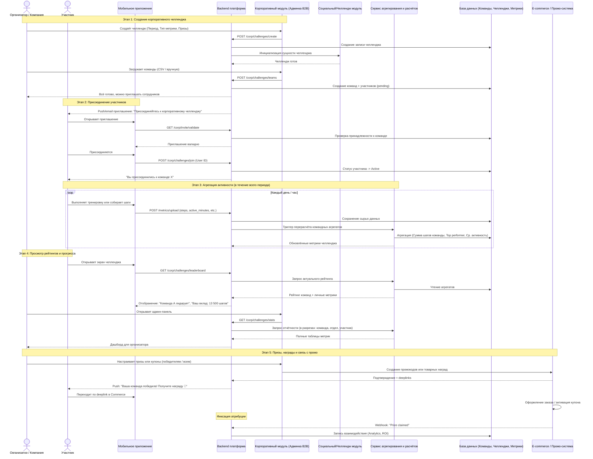
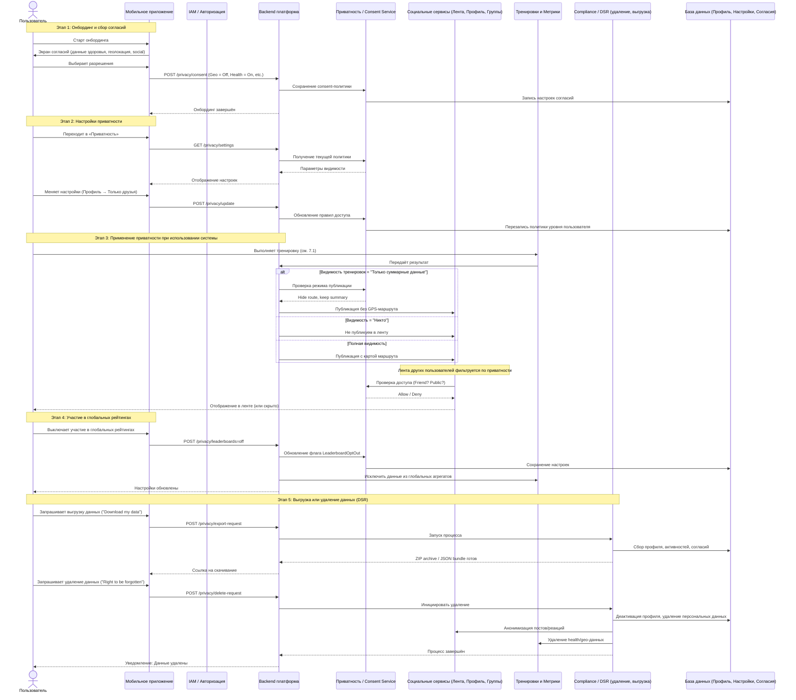
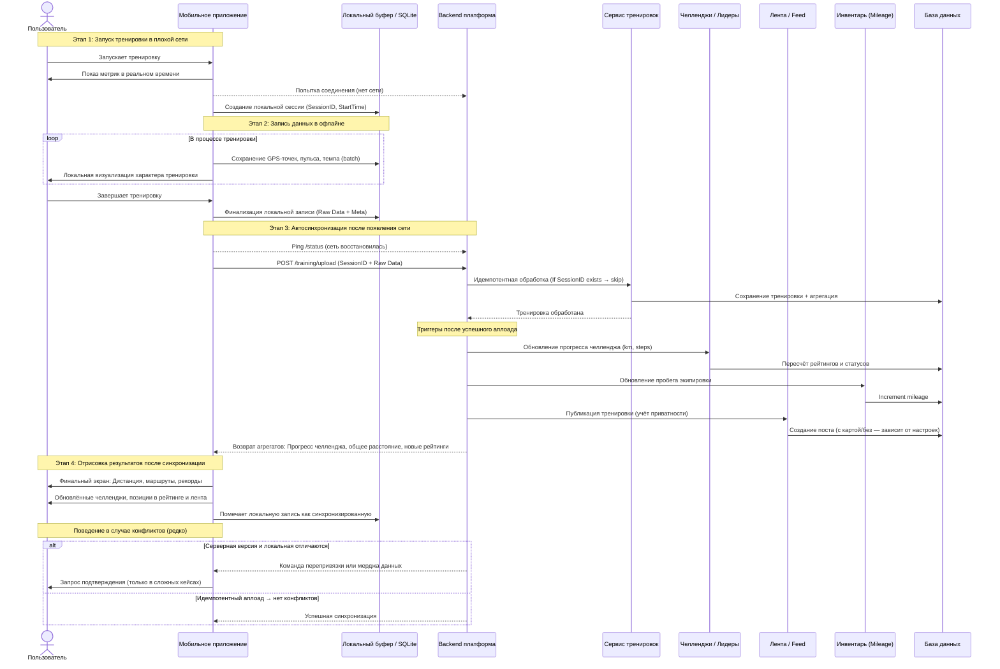

## 7. Выделение критических бизнес‑сценариев

Ниже — набор сценариев уровня «user journey», которые напрямую поддерживают наши бизнес‑цели (community‑first, персонализация, commerce, платформа) и будут драйвить архитектурные решения.

### 7.1. Ежедневная тренировка и сравнение с собой

**Цель:** пользователь быстро фиксирует тренировку, видит свой прогресс и получает базовую мотивацию.

**Сценарий:**

1. Пользователь открывает приложение и запускает тренировку (или импортирует её из системы телефона / устройства).
2. Во время и после тренировки собираются ключевые метрики (дистанция, время, пульс и т.д.).
3. По завершении пользователь видит экран результата с сравнением: «сегодня» vs «предыдущие тренировки» и личные рекорды.
4. Тренировка попадает в историю, агрегаты обновляются (за неделю/месяц), данные доступны для планов, челленджей и commerce.

**Почему критично:**

- Это базовый сценарий, без него приложение теряет смысл как фитнес‑инструмент.
- От качества и надёжности здесь зависят все остальные фичи (персонализация, челленджи, рекомендации, inventory).

**Диаграмма последовательности**

### 7.2. Присоединение к челленджу и участие в нём

**Цель:** усилить мотивацию через соревнование (прежде всего с собой и ближайшим кругом), поддержать community‑first.

**Сценарий:**

1. Пользователь видит в приложении доступные челленджи (личные, групповые, региональные, корпоративные).
2. Выбирает челлендж (например, «пробежать 30 км за 7 дней»), читает правила, присоединяется.
3. В течение периода его тренировки автоматически учитываются в прогрессе челленджа.
4. Пользователь периодически открывает экран челленджа и видит: свой прогресс, позицию в таблице лидеров, прогресс друзей/группы.
5. По завершении челленджа он получает результат, уведомление, бейдж/награду и, возможно, персональное предложение от бренда.

**Почему критично:**

- Это основной сценарий, где сходятся community, тренировки, персонализация и commerce.
- От корректности расчётов и отзывчивости зависят доверие к системе и мотивация продолжать.

**Диаграмма последовательности**

### 7.3. Создание и поддержание привычки через персональный план

**Цель:** перевести пользователя от разовых тренировок к регулярному, структурированному процессу.

**Сценарий:**

1. На онбординге или позже пользователь выбирает цель (например, «подготовиться к 5 км за 8 недель»).
2. Система предлагает план на основе уровня, истории и доступного времени.
3. Пользователь подтверждает план, видит календарь тренировок и ближайшую сессию.
4. В течение недели он получает уведомления о запланированных тренировках, может переносить/облегчать их.
5. При пропусках или перевыполнении план автоматически адаптируется (добавляет лёгкие сессии, снижает нагрузку и т.п.).
6. Пользователь видит прогресс по плану (процент выполнения, оставшиеся недели, улучшение ключевых метрик).

**Почему критично:**

- План — главный инструмент формирования долгосрочной привычки и удержания.
- На его основе строятся персональные рекомендации, мотивационные уведомления и часть промо (экипировка под план).

**Диаграмма последовательности**

### 7.4. Социальное взаимодействие: поддержка и групповые активности

**Цель:** создать ощущение комьюнити и социальной поддержки, без превращения в тяжёлую соцсеть.

**Сценарий:**

1. Пользователь находит знакомых или коллег (по контактам, QR, поиску), добавляет их в друзья.
2. Вступает в локальный клуб/группу по интересам (например, «Минск, вечерние пробежки»).
3. После тренировки его результат появляется в ленте друзей/группы.
4. Друзья оставляют реакции и короткие комментарии, приглашают в совместный челлендж или на офлайн‑тренировку.
5. Группа создаёт свой челлендж/ивент, участники присоединяются, видят общий прогресс и общие результаты.

**Почему критично:**

- Социальная поддержка и чувство принадлежности — ключевые факторы долгосрочного удержания в фитнес‑приложениях.
- Сценарий влияет на требования к ленте, группам, приватности и модерации.

**Диаграмма последовательности**

### 7.5. Использование и обновление инвентаря (связка с коммерцией)

**Цель:** нативно связать реальные тренировки и инвентарь пользователя с рекомендациями и продажами.

**Сценарий:**

1. Пользователь добавляет свои кроссовки/инвентарь (выбор модели из бренда или ввод вручную).
2. Во время тренировок пробег/использование автоматически накапливается.
3. При достижении порога (например, 600–800 км) пользователь получает уведомление: «кроссовкам пора на замену» + подборку моделей бренда.
4. На экране инвентаря пользователь видит статус: «новые», «в активном использовании», «рекомендуется замена».
5. По клику на рекомендацию он попадает на карточку товара в основном e‑commerce (deeplink).

**Почему критично:**

- Это ключевой «мост» между тренировками и бизнес‑результатами (LTV, продажи).
- Требует корректной интеграции данных тренировок, каталога и промо, а также аккуратного UX (чтобы не выглядеть навязчивой рекламой).

**Диаграмма последовательности**

### 7.6. Корпоративный / массовый сценарий: командный челлендж

**Цель:** поддержать B2B‑использование и массовые мероприятия, важные для бренда.

**Сценарий:**

1. Представитель компании или организатор события создаёт корпоративный/массовый челлендж (например, «команды департаментов, кто больше пройдет шагов за месяц»).
2. Сотрудники/участники получают приглашения, присоединяются через приложение.
3. В течение периода система агрегирует данные по участникам и командам (шаги, активные минуты и т.п.).
4. Организатор и участники видят рейтинг команд, общий прогресс и финальные результаты.
5. Бренд может связать награды/призы с продукцией и промо‑кампаниями.

**Почему критично:**

- Даёт дополнительный канал монетизации и продвижения через B2B и события.
- Накладывает требования к масштабируемости, отчётности и ролям/доступам.

**Диаграмма последовательности**

### 7.7. Сценарий приватности и контроля над данными

**Цель:** дать пользователю чувство контроля над тем, что и кому видно, и тем самым снизить барьер использования.

**Сценарий:**

1. При онбординге пользователь видит экран согласий (персональные данные, health‑данные, геолокация) и может гибко настроить разрешения.
2. В настройках есть раздел «Приватность»:
    - видимость профиля (все, только друзья, никто);
    - видимость тренировок и маршрутов (полная карта, только суммарные показатели, скрыть полностью);
    - участие в глобальных рейтингах и публичных челленджах.
3. Пользователь в любой момент может изменить настройки и запросить выгрузку/удаление своих данных.

**Почему критично:**

- Без доверия к приватности пользователи не будут делиться реальными данными (особенно гео и health), а значит потеряется ценность community и персонализации.
- Влияет на архитектурные решения по данным, IAM, event‑модели и отображению информации.

**Диаграмма последовательности**

### 7.8. Сценарий восстановления после проблем связи (офлайн → онлайн)

**Цель:** обеспечить надёжность ключевых сценариев тренировки и участия в челленджах в условиях плохой связи.

**Сценарий:**

1. Пользователь запускает тренировку в месте с плохим интернетом (лес, горы, «дикие» локации).
2. Тренировка записывается локально, данные о маршруте и метриках буферизуются в приложении.
3. При восстановлении соединения приложение синхронизирует тренировку с сервером, обновляет историю, прогресс челленджей и ленту.
4. Пользователь видит свои результаты и обновлённые рейтинги, как будто тренировка была онлайн.

**Почему критично:**

- Реальные спортивные активности часто происходят не в идеальных сетевых условиях.
- Потеря тренировки — один из самых болезненных сценариев для пользователя и бренда.

**Диаграмма последовательности**

[Назад](../README.md)