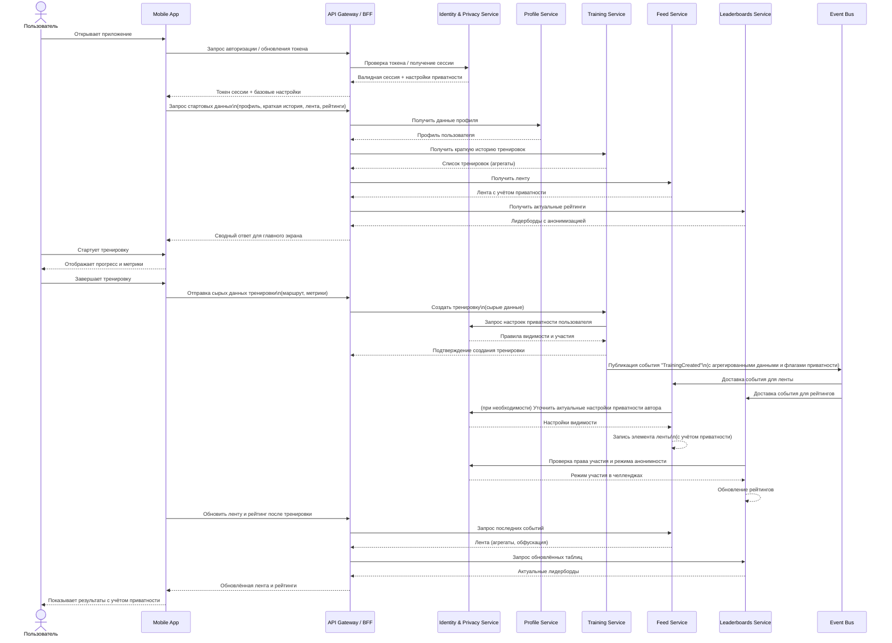

## 13. Базовая архитектура и ограничения

Архитектура приложения — микросервисная, с Mobile App + BFF и набором доменных сервисов (Identity \& Privacy, Profile, Training, Feed, Leaderboards), спроектированных с учётом ключевых НФТ и принципов Privacy by Design.
***

### 13.1 Входные бизнес‑ограничения

- Массовый B2C‑сценарий: десятки/сотни тысяч MAU, пики нагрузки утром/вечером, требования к комфортному времени отклика интерфейса.
- Богатые social‑функции (лента, челленджи, рейтинги) для повышения вовлечённости, но без нарушения приватности пользователей.
- Интеграция с существующей экосистемой бренда (SSO, аккаунты, CRM), использование брендового SSO как источника идентичности.
- Регуляторные ожидания по защите персональных и чувствительных данных (здоровье, геолокация), необходимость демонстрируемого соответствия принципам Privacy by Design.

***

### 13.2 НФТ и выбранный архитектурный стиль

Ключевые атрибуты качества: производительность, масштабируемость, безопасность/приватность, доступность, модифицируемость, наблюдаемость.

- **Архитектурный стиль:** микросервисы, ориентированные на домены (Identity \& Privacy, Profile, Training, Feed, Leaderboards), с BFF/API Gateway между Mobile App и внутренними сервисами.
- **Коммуникация:** синхронные REST/gRPC вызовы для запросов, асинхронные события (event bus) для публикации изменений тренировок, профилей, настроек приватности.
- **Хранение:** разделённые схемы/БД на сервис, с явным разграничением сырых чувствительных данных (маршруты, метрики) и агрегированных представлений для social‑функций.

***

### 13.3 Базовые компоненты

- **Mobile App (iOS/Android)** — запись тренировок, гео и метрик, локальный кеш, UI для ленты, рейтингов и настроек приватности; часть логики privacy‑by‑default реализуется на клиенте (например, явные экранные подсказки).
- **API Gateway / BFF** — единый вход, агрегация данных из доменных сервисов, enforcement аутентификации/авторизации, простые кэш‑стратегии для публичных/полупубличных данных.
- **Identity \& Privacy Service** — аутентификация (через Brand SSO), хранение и выдача настроек приватности, управление согласиями, аудит доступа; центральная точка принятия решений по privacy для остальных сервисов.
- **Profile Service** — профиль пользователя, публичные атрибуты (имя, аватар, базовые достижения) с учётом ограничений приватности при чтении.
- **Training Service** — хранение тренировок, сырых маршрутов и метрик, расчёт агрегатов; при публикации событий в Feed/Leaderboards сразу учитывает настройки приватности.
- **Feed Service** — формирование ленты (события друзей/челленджей), агрегация, фильтрация и обфускация данных в соответствии с настройками авторов.
- **Leaderboards Service** — расчёт рейтингов и челленджей по агрегированным данным, поддержка анонимного участия, исключение пользователей по их выбору.
- **Общие инфраструктурные сервисы:** event bus, логирование и трассировка, мониторинг, Notification/Push, централизованный секрет‑менеджмент.

***

### 13.4 Адресация атрибутов качества

**Производительность и отзывчивость**

- Разделение чтения и записи (много чтения в ленте/рейтингах, относительно меньше записей тренировок).
- Кэширование популярных запросов в BFF (например, агрегированные лидерборды, публичные профили) с коротким TTL.
- Асинхронная обработка тяжёлых операций (перерасчёт рейтингов, построение агрегатов) через очередь/стрим.

**Масштабируемость**

- Независимое масштабирование Training, Feed и Leaderboards, наиболее нагруженных сервисов.
- Stateless‑подход для API‑слоя и большинства доменных сервисов, чтобы горизонтально масштабировать инстансы.

**Доступность и отказоустойчивость**

- Репликация БД и развёртывание в нескольких зонах/регионах, где это необходимо.
- Circuit breakers и тайм‑ауты между сервисами, fallback‑логика (например, деградация ленты до недавних локальных данных).

**Безопасность и приватность**

- Privacy as default: консервативные настройки приватности при онбординге, минимизация данных в публичных интерфейсах.
- Централизация политики приватности в Identity \& Privacy Service, который выступает точкой проверки прав на раскрытие данных.
- Шифрование данных в транзите и на диске, отдельные хранилища/таблицы для чувствительных геоданных и health‑метрик.
- Логирование и аудит доступа к чувствительным данным (кто, когда, на каком основании видел маршрут/метрики).

**Модифицируемость и расширяемость**

- Чёткое разделение доменов (идентичность/приватность, тренировки, социальные функции), что позволяет развивать их независимо.
- Использование критериев качества (fitness functions) в CI/CD для проверки, что новые фичи не нарушают ограничения по производительности и приватности.

**Наблюдаемость и управляемость**

- Единый стандарт логирования и трассировки для всех сервисов, корреляция по trace‑id от Mobile App до backend‑сервисов.
- Метрики по ключевым атрибутам качества (latency, error rate, privacy‑related события) и алерты на деградации.

***

### 13.5 Влияние выбранной архитектуры на развитие

- Микросервисный подход и вынесение Identity \& Privacy в отдельный сервис позволяют добавлять новые каналы (веб‑клиент, интеграции с партнёрами) без дублирования приватностной логики.
- Чёткое разделение сырых и агрегированных данных упрощает запуск новых аналитических и social‑функций, не нарушая базовые принципы Privacy by Design.
- Наличие фитнес‑функций для архитектурных характеристик (в первую очередь приватность, производительность и доступность) позволяет эволюционировать систему без потери качества.

### 13.6 Пример диаграммы последовательности выбранной архитектуры

[Назад](../README.md)