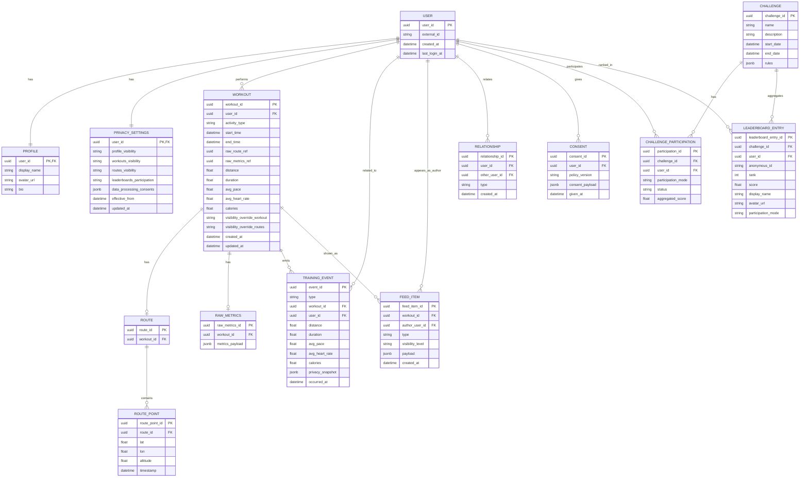

## 14.2 Информационное представление

### 14.2.1 Ключевые доменные сущности

**Пользователь (User)**

- `userId` — уникальный идентификатор.
- `externalId` — идентификатор в брендовой SSO‑системе.
- `createdAt`, `lastLoginAt` — даты создания/последнего входа.

**Профиль (Profile)**

- `userId` — ссылка на пользователя.
- `displayName` — отображаемое имя.
- `avatarUrl` — ссылка на аватар.
- `bio` — краткое описание.
- `preferredActivities` — список типов активностей.

**Настройки приватности (PrivacySettings)**

- `userId` — ссылка на пользователя.
- `profileVisibility` — `PUBLIC | FRIENDS_ONLY | PRIVATE`.
- `workoutsVisibility` — `FULL | AGGREGATED_ONLY | HIDDEN`.
- `routesVisibility` — `FULL | OBFUSCATED | HIDDEN`.
- `leaderboardsParticipation` — `OPT_IN | ANONYMOUS | OPT_OUT`.
- `dataProcessingConsents` — набор флагов согласий (гео, здоровье, аналитика и т.п.).
- `effectiveFrom`, `updatedAt` — временные метки актуальности.

**Тренировка (Workout)**

- `workoutId` — уникальный идентификатор.
- `userId` — владелец.
- `activityType` — тип активности (run, walk, bike и т.п.).
- `startTime`, `endTime`.
- `rawRouteRef` — ссылка на сырые GPS‑точки (отдельное хранилище).
- `rawMetricsRef` — ссылка на сырые метрики (частота пульса, шаги, высота).
- `aggregatedMetrics` — встраиваемый объект:
    - `distance`, `duration`, `avgPace`, `avgHeartRate`, `calories` и т.п.
- `visibilityOverride` — опциональный override видимости именно этой тренировки.
- `createdAt`, `updatedAt`.

**Маршрут (RoutePoint / Route)**
(часто хранится отдельно от Workout, в специализированном хранилище)

- `routeId`.
- `workoutId`.
- `points[]` — список точек:
    - `lat`, `lon`, `altitude`, `timestamp`.

**Событие тренировки (TrainingEvent)**
(сообщение в шине событий)

- `eventId`.
- `type` — `"WORKOUT_CREATED" | "WORKOUT_UPDATED" | ...`.
- `workoutId`, `userId`.
- `aggregatedMetrics` — агрегированные данные.
- `privacySnapshot` — снимок ключевых настроек приватности на момент события.
- `occurredAt`.

**Элемент ленты (FeedItem)**

- `feedItemId`.
- `workoutId` (если применимо).
- `authorUserId`.
- `visibilityLevel` — рассчитанный уровень видимости (для текущего читателя).
- `payload` — данные для отображения:
    - агрегаты (дистанция, время и т.п.);
    - ссылки на автора (псевдоним/аватар/анонимный ник).
- `createdAt`.

**Челлендж (Challenge)**

- `challengeId`.
- `name`, `description`.
- `startDate`, `endDate`.
- `rules` — описание критериев (тип активности, период, метрика и т.п.).

**Участие в челлендже (ChallengeParticipation)**

- `challengeId`.
- `userId`.
- `participationMode` — `NAMED | ANONYMOUS`.
- `status` — `ACTIVE | LEFT | COMPLETED`.
- `aggregatedScore` — текущий результат.

**Запись лидерборда (LeaderboardEntry)**

- `leaderboardId` / `challengeId`.
- `userId` или `anonymousId`.
- `rank`.
- `score`.
- `displayName`, `avatarUrl` (опциональны, зависят от настроек приватности).


### 14.2.2 Логическое разбиение данных по сервисам

**Identity \& Privacy Service**

- Таблицы/коллекции:
    - `Users` (минимальный технический профиль, связка с внешним SSO).
    - `PrivacySettings` (ключевой источник настроек приватности).
    - `Consents` (история согласий с версиями политики).

**Profile Service**

- `Profiles` — данные профиля, не чувствительные по сути, но фильтруемые по приватности.

**Training Service**

- `Workouts` — основные данные тренировки + агрегаты.
- `Routes` или внешнее blob/GIS‑хранилище для `rawRouteRef`.
- `RawMetrics` или отдельное хранилище для детализированных метрик.

**Feed Service**

- `FeedItems` — материализованное представление ленты.
- Дополнительные индексы по `userId`, `createdAt`.

**Leaderboards Service**

- `Challenges`.
- `ChallengeParticipations`.
- `LeaderboardEntries` (материализованные результаты).

**Social/Relationships Service**

- `Relationships` — связи `userId` ↔ `friendId` / `followerId`.


### 14.2.3 Основные потоки данных

**1. Сохранение тренировки и формирование агрегатов**

- Mobile App → Training Service: сырые данные тренировки (маршрут, метрики, базовые агрегаты).
- Training Service:
    - сохраняет `Workout`, `Route`, `RawMetrics`;
    - рассчитывает/уточняет `aggregatedMetrics`;
    - запрашивает у Identity \& Privacy текущий `PrivacySettings` для `userId`;
    - публикует `TrainingEvent` с агрегатами и `privacySnapshot`.

**2. Обновление ленты**

- Feed Service получает `TrainingEvent`.
- На основе `privacySnapshot` и социального графа решает, какие данные и кому могут быть показаны.
- Формирует и сохраняет `FeedItem` для релевантных пользователей (fan‑out on write или комбинированная стратегия).

**3. Обновление лидербордов**

- Leaderboards Service получает `TrainingEvent`.
- Находит все актуальные `ChallengeParticipation` для данного `userId`.
- Обновляет `aggregatedScore` и пересчитывает `LeaderboardEntries` с учётом `participationMode` и настроек приватности.

**4. Чтение данных клиентом**

- Для главного экрана Mobile App запрашивает через BFF:
    - профиль → `Profile` (с фильтрацией по `PrivacySettings` пользователя относительно самого себя минимальна);
    - историю тренировок → `Workouts` (полный объём для владельца);
    - ленту → `FeedItems` (уже предфильтрованные);
    - лидерборды → `LeaderboardEntries` (с учётом анонимности/отсевов).


### 14.2.4 Информационные ограничения и принципы

- **Разделение сырых и агрегированных данных:** маршруты и детальные метрики хранятся отдельно и никогда напрямую не используются в публичных интерфейсах без проверки настроек приватности.
- **Снимок настроек приватности в событиях:** каждый `TrainingEvent` несёт `privacySnapshot`, чтобы downstream‑сервисы могли корректно обрабатывать данные даже при последующем изменении настроек.
- **Минимизация данных в чтении:** BFF и доменные сервисы возвращают клиенту только необходимые для конкретного сценария атрибуты, а не полные сущности.
- **Трассируемость и аудит:** изменения `PrivacySettings`, `Consents` и критичных сущностей (`Workouts`) должны быть аудируемы (кто и когда изменил данные).


### 14.2.5 Диаграмма сущность‑связь (ERD)


[Назад](../README.md)

### 14.2.6 Пример JSON Schema основных DTO

```json
// schemas/user-profile.dto.schema.json
{
  "$schema": "http://json-schema.org/draft-07/schema#",
  "$id": "user-profile.dto.schema.json",
  "title": "UserProfileDto",
  "type": "object",
  "properties": {
    "userId": { "type": "string", "format": "uuid" },
    "displayName": { "type": "string", "maxLength": 100 },
    "avatarUrl": { "type": "string", "format": "uri", "nullable": true },
    "bio": { "type": "string", "maxLength": 500, "nullable": true },
    "preferredActivities": {
      "type": "array",
      "items": { "type": "string" }
    }
  },
  "required": ["userId", "displayName"],
  "additionalProperties": false
}


// schemas/privacy-settings.dto.schema.json
{
  "$schema": "http://json-schema.org/draft-07/schema#",
  "$id": "privacy-settings.dto.schema.json",
  "title": "PrivacySettingsDto",
  "type": "object",
  "properties": {
    "profileVisibility": {
      "type": "string",
      "enum": ["PUBLIC", "FRIENDS_ONLY", "PRIVATE"]
    },
    "workoutsVisibility": {
      "type": "string",
      "enum": ["FULL", "AGGREGATED_ONLY", "HIDDEN"]
    },
    "routesVisibility": {
      "type": "string",
      "enum": ["FULL", "OBFUSCATED", "HIDDEN"]
    },
    "leaderboardsParticipation": {
      "type": "string",
      "enum": ["OPT_IN", "ANONYMOUS", "OPT_OUT"]
    },
    "dataProcessingConsents": {
      "type": "object",
      "properties": {
        "geo": { "type": "boolean" },
        "health": { "type": "boolean" },
        "analytics": { "type": "boolean" }
      },
      "additionalProperties": false
    },
    "effectiveFrom": { "type": "string", "format": "date-time" },
    "updatedAt": { "type": "string", "format": "date-time" }
  },
  "required": [
    "profileVisibility",
    "workoutsVisibility",
    "routesVisibility",
    "leaderboardsParticipation"
  ],
  "additionalProperties": false
}


// schemas/workout-create.dto.schema.json
{
  "$schema": "http://json-schema.org/draft-07/schema#",
  "$id": "workout-create.dto.schema.json",
  "title": "WorkoutCreateDto",
  "type": "object",
  "properties": {
    "activityType": {
      "type": "string",
      "enum": ["RUN", "WALK", "BIKE", "OTHER"]
    },
    "startTime": { "type": "string", "format": "date-time" },
    "endTime": { "type": "string", "format": "date-time" },
    "aggregatedMetrics": {
      "type": "object",
      "properties": {
        "distance": { "type": "number", "minimum": 0 },
        "duration": { "type": "number", "minimum": 0 },
        "avgPace": { "type": "number", "minimum": 0 },
        "avgHeartRate": { "type": "number", "minimum": 0, "nullable": true },
        "calories": { "type": "number", "minimum": 0, "nullable": true }
      },
      "required": ["distance", "duration"],
      "additionalProperties": false
    },
    "route": {
      "type": "object",
      "properties": {
        "points": {
          "type": "array",
          "items": {
            "type": "object",
            "properties": {
              "lat": { "type": "number", "minimum": -90, "maximum": 90 },
              "lon": { "type": "number", "minimum": -180, "maximum": 180 },
              "altitude": { "type": "number", "nullable": true },
              "timestamp": { "type": "string", "format": "date-time" }
            },
            "required": ["lat", "lon", "timestamp"],
            "additionalProperties": false
          }
        }
      },
      "required": ["points"],
      "additionalProperties": false
    },
    "visibilityOverride": {
      "type": "object",
      "properties": {
        "workoutVisibility": {
          "type": "string",
          "enum": ["FULL", "AGGREGATED_ONLY", "HIDDEN"]
        },
        "routesVisibility": {
          "type": "string",
          "enum": ["FULL", "OBFUSCATED", "HIDDEN"]
        }
      },
      "additionalProperties": false
    }
  },
  "required": ["activityType", "startTime", "endTime", "aggregatedMetrics"],
  "additionalProperties": false
}


// schemas/workout-response.dto.schema.json
{
  "$schema": "http://json-schema.org/draft-07/schema#",
  "$id": "workout-response.dto.schema.json",
  "title": "WorkoutResponseDto",
  "type": "object",
  "properties": {
    "workoutId": { "type": "string", "format": "uuid" },
    "userId": { "type": "string", "format": "uuid" },
    "activityType": {
      "type": "string",
      "enum": ["RUN", "WALK", "BIKE", "OTHER"]
    },
    "startTime": { "type": "string", "format": "date-time" },
    "endTime": { "type": "string", "format": "date-time" },
    "aggregatedMetrics": {
      "$ref": "workout-create.dto.schema.json#/properties/aggregatedMetrics"
    },
    "hasRoute": { "type": "boolean" },
    "visibility": {
      "type": "object",
      "properties": {
        "effectiveWorkoutVisibility": {
          "type": "string",
          "enum": ["FULL", "AGGREGATED_ONLY", "HIDDEN"]
        },
        "effectiveRoutesVisibility": {
          "type": "string",
          "enum": ["FULL", "OBFUSCATED", "HIDDEN"]
        }
      },
      "required": ["effectiveWorkoutVisibility", "effectiveRoutesVisibility"],
      "additionalProperties": false
    },
    "createdAt": { "type": "string", "format": "date-time" },
    "updatedAt": { "type": "string", "format": "date-time" }
  },
  "required": [
    "workoutId",
    "userId",
    "activityType",
    "startTime",
    "endTime",
    "aggregatedMetrics",
    "hasRoute",
    "visibility"
  ],
  "additionalProperties": false
}


// schemas/feed-item.dto.schema.json
{
  "$schema": "http://json-schema.org/draft-07/schema#",
  "$id": "feed-item.dto.schema.json",
  "title": "FeedItemDto",
  "type": "object",
  "properties": {
    "feedItemId": { "type": "string", "format": "uuid" },
    "type": {
      "type": "string",
      "enum": ["WORKOUT", "CHALLENGE_UPDATE", "SYSTEM"]
    },
    "author": {
      "type": "object",
      "properties": {
        "userId": { "type": "string", "format": "uuid" },
        "displayName": { "type": "string" },
        "avatarUrl": { "type": "string", "format": "uri", "nullable": true },
        "isAnonymous": { "type": "boolean" }
      },
      "required": ["userId", "displayName", "isAnonymous"],
      "additionalProperties": false
    },
    "visibilityLevel": {
      "type": "string",
      "enum": ["FULL", "AGGREGATED_ONLY", "MINIMAL"]
    },
    "workout": {
      "type": "object",
      "properties": {
        "workoutId": { "type": "string", "format": "uuid" },
        "activityType": {
          "type": "string",
          "enum": ["RUN", "WALK", "BIKE", "OTHER"]
        },
        "startTime": { "type": "string", "format": "date-time" },
        "aggregatedMetrics": {
          "$ref": "workout-create.dto.schema.json#/properties/aggregatedMetrics"
        },
        "routePreview": {
          "type": "object",
          "properties": {
            "polyline": { "type": "string" },
            "precision": { "type": "string", "enum": ["LOW", "MEDIUM"] }
          },
          "additionalProperties": false
        }
      },
      "required": ["workoutId", "activityType", "startTime", "aggregatedMetrics"],
      "additionalProperties": false
    },
    "createdAt": { "type": "string", "format": "date-time" }
  },
  "required": [
    "feedItemId",
    "type",
    "author",
    "visibilityLevel",
    "createdAt"
  ],
  "additionalProperties": false
}


// schemas/leaderboard-entry.dto.schema.json
{
  "$schema": "http://json-schema.org/draft-07/schema#",
  "$id": "leaderboard-entry.dto.schema.json",
  "title": "LeaderboardEntryDto",
  "type": "object",
  "properties": {
    "challengeId": { "type": "string", "format": "uuid" },
    "rank": { "type": "integer", "minimum": 1 },
    "score": { "type": "number", "minimum": 0 },
    "user": {
      "type": "object",
      "properties": {
        "userId": {
          "type": "string",
          "format": "uuid",
          "nullable": true
        },
        "anonymousId": {
          "type": "string",
          "nullable": true
        },
        "displayName": {
          "type": "string",
          "nullable": true
        },
        "avatarUrl": {
          "type": "string",
          "format": "uri",
          "nullable": true
        },
        "participationMode": {
          "type": "string",
          "enum": ["NAMED", "ANONYMOUS"]
        }
      },
      "required": ["participationMode"],
      "additionalProperties": false
    }
  },
  "required": ["challengeId", "rank", "score", "user"],
  "additionalProperties": false
}


// schemas/challenge.dto.schema.json
{
  "$schema": "http://json-schema.org/draft-07/schema#",
  "$id": "challenge.dto.schema.json",
  "title": "ChallengeDto",
  "type": "object",
  "properties": {
    "challengeId": { "type": "string", "format": "uuid" },
    "name": { "type": "string", "maxLength": 200 },
    "description": { "type": "string", "maxLength": 2000 },
    "startDate": { "type": "string", "format": "date-time" },
    "endDate": { "type": "string", "format": "date-time" },
    "rules": {
      "type": "object",
      "properties": {
        "activityTypes": {
          "type": "array",
          "items": {
            "type": "string",
            "enum": ["RUN", "WALK", "BIKE", "OTHER"]
          }
        },
        "metric": {
          "type": "string",
          "enum": ["DISTANCE", "DURATION", "CALORIES"]
        },
        "targetValue": { "type": "number", "minimum": 0 }
      },
      "required": ["activityTypes", "metric"],
      "additionalProperties": false
    }
  },
  "required": ["challengeId", "name", "startDate", "endDate", "rules"],
  "additionalProperties": false
}

```

[Назад](../README.md)