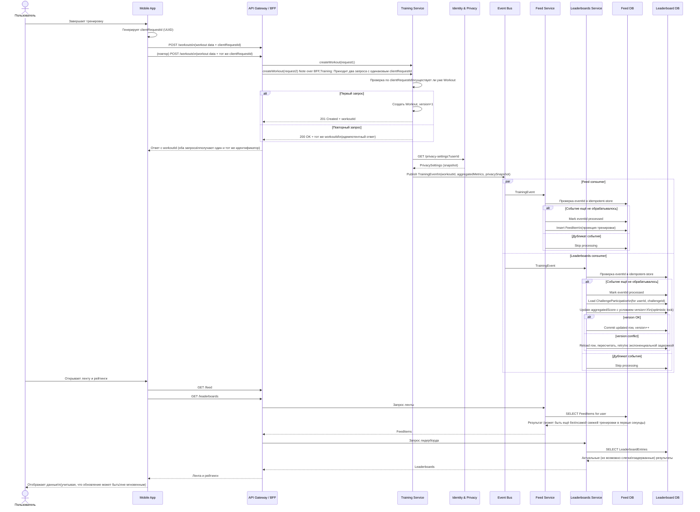

## 14.3 Многозадачность (concurrency)

Этот раздел описывает, как система ведёт себя при параллельных запросах, конкурентных изменениях данных и асинхронной обработке, с учётом eventual consistency для ленты и лидербордов.

### 14.3.1 Общие принципы

- **Stateless‑сервисы на уровне API и домена.** Каждый экземпляр BFF, Training, Feed, Leaderboards и т.п. не хранит пользовательское состояние в памяти между запросами; масштабирование — горизонтальное.
- **Eventual consistency.** Лента и лидерборды не гарантируют мгновенной консистентности после записи тренировки; допустимы небольшие задержки между завершением тренировки и её появлением в UI.
- **Минимизация блокировок.** Предпочитаются оптимистичные стратегии (версирование сущностей, идемпотентные операции) вместо тяжёлых распределённых блокировок, кроме узких точек (например, перерасчёт одного leaderboard‑шарда).


### 14.3.2 Модель конкурентной записи тренировок

- Один пользователь может отправить несколько тренинговых сессий почти одновременно (переподключение сети, ретраи клиента).
- Для `Workout` используется:
    - идемпотентный `clientRequestId` в запросе на создание (для защиты от дубликатов при повторах);
    - оптимистичная блокировка по полю `version` при обновлениях существующей тренировки (например, редактирование заметки или видимости).
- При конфликте версии сервер возвращает ошибку «conflict / 409», клиент может перезагрузить данные и повторить изменения.


### 14.3.3 Обработка событий и ленты в условиях параллелизма

- Training Service публикует `TrainingEvent` в шину событий после успешного коммита транзакции с тренировкой.
- Feed Service и Leaderboards Service читают события асинхронно, с возможной параллельной обработкой по партициям (например, по `userId` или `challengeId`).
- Для предотвращения двойной обработки:
    - консьюмеры событий должны быть **идемпотентными**,
    - для каждого события хранится offset/marker или лог обработки (event id → processed).
- В результате разные пользователи могут на короткое время видеть «разные миры» ленты/рейтингов; система гарантирует выравнивание со временем (eventual consistency).


### 14.3.4 Конкурентные изменения настроек приватности

- `PrivacySettings` меняются реже, чем тренировки, но могут меняться параллельно с активной записью/завершением тренировок.
- Identity \& Privacy Service использует версии сущностей (optimistic locking) и аудит изменений.
- Для событий (`TrainingEvent`) встраивается `privacySnapshot` — снимок актуальных настроек на момент генерации события. Это гарантирует корректную интерпретацию тренировки downstream‑сервисами, даже если пользователь позже изменил настройки.
- При чтении ленты/рейтингов дополнительно применяется **runtime‑проверка** текущих настроек, чтобы скрыть данные, если пользователь ужесточил приватность после публикации.


### 14.3.5 Конкуренция в лидербордах и челленджах

- Перерасчёт `LeaderboardEntry` может выполняться параллельно для разных `challengeId` или шардов.
- Для одного и того же челленджа:
    - используется либо секционирование по диапазонам пользователей, либо локальные транзакции с оптимистичной блокировкой суммарного результата (`aggregatedScore`, `version`);
    - при высоких нагрузках допускается батч‑обновление рейтингов с периодической пересортировкой (каждые N секунд/минут).
- Конфликты обновления одной и той же записи рейтинга (много событий подряд) решаются через повтор операции (retry с экспоненциальной задержкой) до успешного обновления версии.


### 14.3.6 Ограничение конкурентных операций и защита от штормов

- **Rate limiting** и throttling на уровне BFF для «дорогих» операций (массовые запросы к ленте, частые обновления настроек приватности).
- **Очереди** и backpressure в Event Bus: при всплеске событий (например, массовый челлендж) система будет перерабатывать их с ограниченной степенью параллелизма, разгружая ядро.
- Для особо чувствительных участков (например, раздача ограниченных призов по результатам челленджа) может применяться узкоспециализированный распределённый лок (Redis/ZooKeeper/DB‑lock), но это исключение, а не правило.

### 14.3.7 Влияние на UX и контракты

- Пользователь может не увидеть свою тренировку в ленте/рейтинге **мгновенно**, но получит её в течение короткого времени (секунды/десятки секунд) — это явно учитывается в UX (спиннеры, «обновить»).
- API‑контракты формулируются так, чтобы не обещать сильной консистентности для ленты и лидербордов, но гарантировать атомарность операций на уровне «создание тренировки», «обновление настроек приватности», «участие в челлендже».

### 14.3.8 Диаграмма последовательности для concurrency сценария в микросервисах


### 14.3.9 Базовая схема DTO c полем version под optimistic locking

```json
// schemas/optimistic-locking.dto.schema.json
{
  "$schema": "http://json-schema.org/draft-07/schema#",
  "$id": "optimistic-locking.dto.schema.json",
  "title": "OptimisticLockingDto",
  "description": "Базовый контракт для DTO, поддерживающих оптимистичную блокировку через поле version.",
  "type": "object",
  "properties": {
    "id": {
      "description": "Идентификатор ресурса (может быть workoutId, profileId и т.п.).",
      "type": "string"
    },
    "version": {
      "description": "Текущая версия ресурса для оптимистичного контроля конкуренции. Должна передаваться клиентом при обновлении/удалении.",
      "type": "integer",
      "minimum": 0
    }
  },
  "required": ["id", "version"],
  "additionalProperties": true
}
```

**Пример «встраивания» в DTO тренировки (фрагмент):**

```json
// schemas/workout-update.dto.schema.json
{
  "$schema": "http://json-schema.org/draft-07/schema#",
  "$id": "workout-update.dto.schema.json",
  "title": "WorkoutUpdateDto",
  "allOf": [
    { "$ref": "optimistic-locking.dto.schema.json" },
    {
      "type": "object",
      "properties": {
        "note": { "type": "string", "maxLength": 1000 },
        "visibilityOverride": {
          "type": "object",
          "properties": {
            "workoutVisibility": {
              "type": "string",
              "enum": ["FULL", "AGGREGATED_ONLY", "HIDDEN"]
            },
            "routesVisibility": {
              "type": "string",
              "enum": ["FULL", "OBFUSCATED", "HIDDEN"]
            }
          },
          "additionalProperties": false
        }
      },
      "additionalProperties": false
    }
  ]
}

```

[Назад](../README.md)