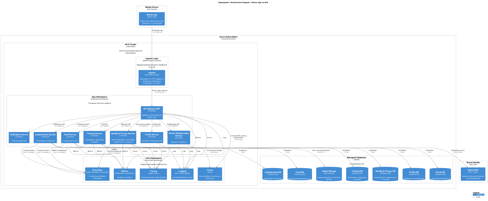

## 14.4 Инфраструктурное представление

Инфраструктурное представление описывает, как логические компоненты развёрнуты в облаке, как к ним попадает трафик, где живут данные и что обеспечивает наблюдаемость и эксплуатацию.

### 14.4.1 Развёртывание и среда исполнения

- **Облако и оркестрация.**
    - Все backend‑сервисы (BFF, Identity \& Privacy, Profile, Training, Feed, Leaderboards, Social, Notification) развёрнуты в Kubernetes‑кластере или эквивалентной контейнерной платформе.
    - Используются Deployment/ReplicaSet для горизонтального масштабирования и Pod‑авторестарта, autoscaling по метрикам нагрузки.
- **Входной трафик.**
    - Mobile App обращается к публичному **API Gateway/Ingress** (NGINX / Gateway API / облачный API Gateway) по HTTPS.
    - Gateway маршрутизирует запросы к BFF, выполняет TLS‑терминацию, базовые WAF‑фильтры и rate limiting.
- **Сетевые зоны.**
    - Публичная зона: API Gateway, CDN/Static hosting для статических ресурсов.
    - Приватная зона: все микросервисы, БД, брокеры сообщений, системы логирования и мониторинга доступны только из приватной сети.

### 14.4.2 Хранение данных

- **Транзакционные БД.**
    - Отдельные управляемые БД/схемы на сервис:
        - Identity \& Privacy (пользователи, настройки, согласия).
        - Profile (профили).
        - Training (workouts, routes, raw metrics).
        - Feed (materialized feed items).
        - Leaderboards (challenges, participations, leaderboard entries).
    - Используются репликация и резервное копирование, отдельные параметры производительности под чтение/запись.
- **Хранилище для «тяжёлых» данных.**
    - Облачное объектное хранилище / специализированное GIS‑хранилище для сырых маршрутов, больших blob‑данных и архивов экспорта пользователя.
- **Кэширование.**
    - In‑memory кэш (Redis‑подобный) для:
        - горячих профилей и настроек приватности;
        - популярных лент/лидербордов;
        - токенов/сессий.

### 14.4.3 Межсервисное взаимодействие

- **Синхронные запросы.**
    - REST/gRPC поверх сервисной mesh/Service/Ingress внутри кластера для запросов BFF → доменные сервисы и домен → Identity \& Privacy.
- **Асинхронные события.**
    - Event Bus (Kafka/RabbitMQ/облачный Pub/Sub) для интеграционных событий `TrainingEvent`, событий приватности и т.п.
    - Feed и Leaderboards подписываются на события, обрабатывают их с учётом своих требований к задержкам и надёжности доставки.

### 14.4.4 Наблюдаемость и эксплуатация

- **Логи, метрики, трейсы.**
    - Централизованный сбор логов (ELK/Cloud Logging), метрик (Prometheus‑подобный стек) и распределённых трассировок (Jaeger/Zipkin).
    - Корреляция по trace‑id от API Gateway через BFF до всех внутренних сервисов.
- **Алертинг и SLO.**
    - Алерты по latency, error rate, насыщенности CPU/памяти, размеру очередей Event Bus, доле ошибок при обработке чувствительных операций (создание тренировки, изменение приватности).
- **CI/CD и IaC.**
    - Инфраструктура описана кодом (Terraform/аналог), автоматизированный деплой кластера, сетей, БД, брокеров, мониторинга.
    - Автоматические пайплайны сборки/деплоя сервисов с канарейками/blue‑green стратегиями для снижения риска.

### 14.4.5 Среды и изоляция

- **Среды:** минимум `dev`, `staging`, `prod`, при необходимости — пер‑feature окружения для интеграционных тестов.
- **Изоляция данных:** прод‑данные физически и логически отделены от тестовых; для разработки/тестирования используются синтетические или анонимизированные наборы.

### [14.4.6 C4 Deployment/Infrastructure диаграмма](../docs/assets/schemas/c4_deployment.puml)

 

[Назад](../README.md)