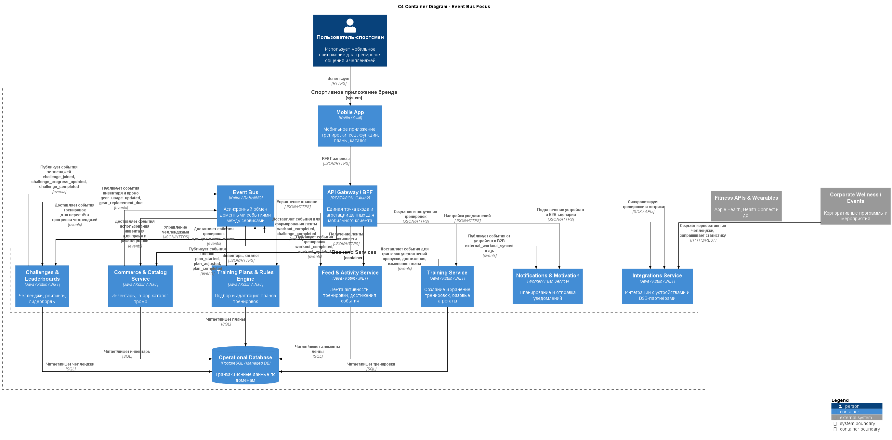

# ADR-003: Гибридное взаимодействие REST + Event-driven через шину сообщений

---

## Context

Система включает несколько доменных сервисов (Training, Community, Feed, Challenges, Plans, Commerce, Integrations), которые:

- обслуживают UX‑критичные сценарии с ожиданием быстрых, предсказуемых ответов (создать тренировку, показать ленту, вступить в челлендж, открыть прогресс по плану);  
- должны реагировать на изменения в других доменах (новая тренировка → обновление ленты и челленджа; изменение плана → уведомления; изменение инвентаря → промо);  
- будут работать под пиковыми нагрузками (массовые челленджи, корпоративные соревнования, глобальные кампании).

Возникает вопрос: строить взаимодействие сервисов только на синхронных запросах/ответах, только на событиях или на комбинации подходов.

---

## Decision

Принято решение использовать **гибридную модель** взаимодействия:

- **Синхронный REST/JSON** поверх HTTPS:  
  - для команд и запросов, идущих от мобильного клиента через API Gateway/BFF (создание/обновление сущностей, получение данных для экранов);  
  - для точечных запросов между сервисами, где важна немедленная консистентность и предсказуемый ответ.

- **Асинхронный обмен событиями через шину сообщений (Event Bus, например Kafka/RabbitMQ):**  
  - для публикации значимых бизнес‑событий:  
    - `workout_completed`, `workout_updated`;  
    - `challenge_joined`, `challenge_progress_updated`, `challenge_completed`;  
    - `plan_started`, `plan_adjusted`, `plan_completed`;  
    - `gear_usage_updated`, `gear_replacement_due`;  
  - для реакций других доменов на эти события (лента, уведомления, commerce, аналитика).  

Таким образом:

- Mobile App ↔ BFF ↔ доменные сервисы — синхронно (REST).  
- Доменные сервисы ↔ другие домены, аналитика, уведомления — асинхронно (events).

---

## Status

- **Accepted** как базовый паттерн взаимодействия между сервисами.  
- В дальнейшем может быть усилен применением CQRS или event sourcing в отдельных доменах, если это будет обосновано.

---

## Consequences

### Положительные

- **Баланс UX и масштабируемости:**  
  - Синхронные REST‑запросы обеспечивают предсказуемое поведение UI и простую модель для клиента.  
  - Event‑driven подход позволяет масштабировать фоны работы (лента, уведомления, аналитика, промо) и подключать новых потребителей событий без изменения инициаторов.

- **Снижение связанности между доменами:**  
  - Источники событий (например, Training) не знают, кто и как их потребляет (Feed, Challenges, Notifications, Commerce, Analytics).  
  - Добавление новых реакций (например, новой аналитики или типа уведомлений) не требует изменения отправителя.

- **Устойчивость к пиковым нагрузкам:**  
  - В пиковые моменты (массовые старты челленджей, корпоративные ивенты) события могут аккумулироваться в шине сообщений и обрабатываться с горизонтальным масштабированием потребителей.

- **Удобная основа для аналитики и ML в будущем:**  
  - Потоки событий можно сразу направлять в аналитический контур (DWH/Data Lake) для продуктовой аналитики и будущих моделей рекомендаций.

### Отрицательные

- **Eventual consistency:**  
  - Между моментом записи тренировки и её появлением во всех производных представлениях (лента, лидерборд, прогресс по плану, промо) может быть небольшая задержка.  
  - Требуется явно учитывать это в UX (например, показывать оптимистические обновления на клиенте или объяснять возможные задержки).

- **Рост сложности системы:**  
  - Необходимо проектировать и версионировать формат событий.  
  - Сложнее отлаживать и тестировать цепочки «команда → события → реакции множества сервисов».

- **Требования к инфраструктуре:**  
  - Поддержка и мониторинг шины сообщений;  
  - необходимость настройки ретраев, dead‑letter‑очередей и механизмов реплея событий.

---

## Alternatives considered

1. **Только синхронные REST‑вызовы между сервисами**  
   - Плюсы:  
     - простая, привычная модель;  
     - легче отладка и трассировка.  
   - Минусы:  
     - сильная связанность сервисов;  
     - каскадные задержки и таймауты при цепочках вызовов;  
     - плохая устойчивость к пикам (например, массовое обновление ленты и рейтингов после событий).  
   - Отклонено: не удовлетворяет требованиям по масштабируемости и устойчивости.

2. **Чисто событийная архитектура (event sourcing + CQRS) для всех доменов**  
   - Плюсы:  
     - максимальное расцепление и гибкость;  
     - богатые возможности для аналитики и «отмотки» состояния.  
   - Минусы:  
     - существенно более высокая сложность, особенно для команды, не имеющей большого опыта с event sourcing;  
     - усложнение клиентских сценариев, где нужны быстрые и простые запросы.  
   - Отклонено как избыточное решение для начальных этапов; возможно локальное применение в отдельных доменах в будущем.

## Links to diagrams

- **[C4 Container Diagram (с Event Bus)](../assets/schemas/arch_schema_c4_event_bus.puml)**  

 

[Назад](../../README.md)

