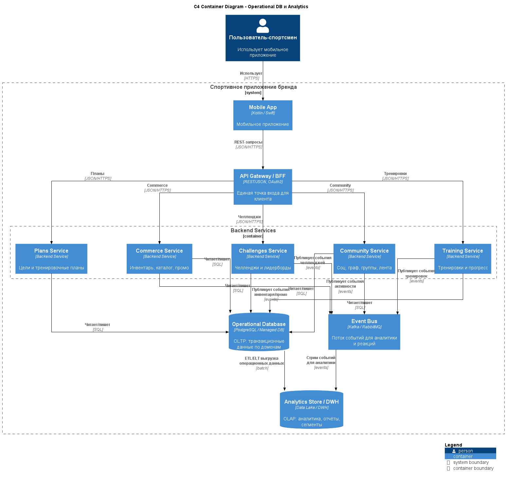

# ADR-004: Старт с общего Operational DB и выделенного аналитического контура

---

## Context

Система оперирует несколькими доменами:

- Training (тренировки, агрегаты, рекорды)  
- Community & Social (друзья, группы, лента, челленджи)  
- Personalization & Plans (цели, планы, правила)  
- Commerce & Gear (инвентарь, in-app каталог, промо)  
- Identity & Security (учётные записи, сессии, приватность)  

Есть противоречивые требования:

- Для старта проекта важно уменьшить сложность (количество хранилищ, миграций, инфраструктурных компонентов).  
- Для будущего развития важны масштабируемость и независимость доменов, а также наличие отдельного контура для аналитики и маркетинга.  

Нужно выбрать подход к управлению данными и хранилищами на уровне контейнеров.

---

## Decision

Принято решение:

1. **MVP и ближайшие этапы:**

   - Использовать **общую операционную БД (Operational DB)** для доменных сервисов, с логическим разделением схем/таблиц по доменам (Training, Community, Commerce, Identity и т.д.).  
   - Вводить строгие правила владения данными: каждый домен имеет «свою» схему/таблицы, а кросс‑доменный доступ осуществляется через API или события.

2. **Аналитика:**

   - Выделить **отдельное аналитическое хранилище (Analytics Store / DWH)**, куда данные из Operational DB и event‑потоков будут реплицироваться/загружаться (ETL/ELT).  
   - Использовать аналитический контур для построения отчётов, маркетинговых сегментов, продуктовой аналитики и потенциальных ML‑моделей, не нагружая основную БД.

3. **Эволюция:**

   - Заложить возможность **поэтапного выноса** отдельных доменов в собственные БД при росте нагрузки или усложнении требований (например, Feed/Challenges, Analytics).  

---

## Status

- **Accepted** как базовый подход к управлению данными на этапах MVP и раннего масштабирования.  
- Будет пересмотрен при достижении определённых порогов нагрузки/сложности (например, когда один из доменов начнёт заметно доминировать по объёму операций).

---

## Consequences

### Положительные

- **Снижение стартовой сложности:**

  - Одна операционная БД проще в настройке и сопровождении, чем сразу несколько отдельных хранилищ per‑service.  
  - Упрощается управление миграциями на ранних этапах.

- **Чёткий раздел «OLTP vs OLAP»:**

  - Операционная БД — для транзакционных запросов (создание/обновление сущностей).  
  - Аналитическое хранилище — для «тяжёлых» отчётов и агрегаций, без влияния на онлайн‑нагрузку.

- **Подготовка к будущему разделению:**

  - Логическое разделение схем по доменам и событийная модель упрощают последующее вынесение отдельных доменов в свои БД.

### Отрицательные

- **Потенциальное узкое горлышко:**

  - При росте числа пользователей и активности общий Operational DB может стать bottleneck, что потребует дополнительных усилий по оптимизации/шардированию.

- **Скрытая связанность доменов:**

  - Несмотря на логическое разделение, физически домены всё ещё зависят от одного кластера БД (риск общего отказа).

- **Перенос сложности в будущее:**

  - Со временем всё равно придётся выносить наиболее нагруженные домены, что потребует миграций и дополнительного планирования.

---

## Alternatives considered

1. **Отдельная БД для каждого домена с самого начала**

   - Плюсы:  
     - максимальная независимость доменов;  
     - гибкость выбора типа хранилища;  
     - лучшая изоляция отказов.
   - Минусы:  
     - значительный рост сложности на старте (несколько схем миграций, больше инфраструктуры);  
     - больше усилий на обеспечение консистентности и кросс‑доменные запросы.  
   - Отклонено как избыточное для MVP.

2. **Только одна БД, без отдельного аналитического контура**

   - Плюсы:  
     - максимально простой старт.  
   - Минусы:  
     - аналитические запросы и отчёты конкурируют за ресурсы с online‑операциями;  
     - сложнее обеспечивать SLA для пользовательских сценариев при росте аналитики.  
   - Отклонено: не соответствует целям по аналитике и устойчивости.

3. **Сразу двухуровневая схема: отдельные БД per‑domain + DWH**

   - Плюсы:  
     - наилучшее логическое разделение;  
     - готовность к высоким нагрузкам.
   - Минусы:  
     - слишком высокая сложность для первого релиза;  
     - увеличенный time‑to‑market.  
   - Рассматривалось как целевое состояние, но не как стартовая точка.

---

## Links to diagrams

- **[C4 Container Diagram (операционная БД + аналитический контур)](../assets/schemas/arch_schema_c4_db.puml)**  

 

[Назад](../../README.md)