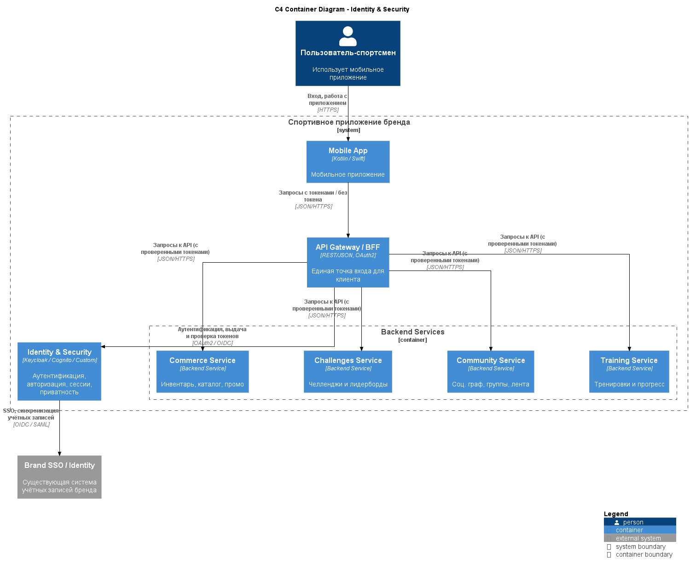

# ADR-005: Выделение домена Identity & Security (SSO, IAM, Privacy)

---

## Context

Приложение обрабатывает:

- персональные данные пользователей (имя, email, возраст и др.);  
- чувствительные данные о здоровье и активности (пульс, расстояние, время, нагрузка);  
- геоданные и маршруты тренировок;  
- социальные связи (друзья, группы, участие в челленджах);  
- историю покупок и инвентаря.

Также:

- у компании уже есть брендовая учётная запись / SSO, используемая в существующих e‑commerce и других приложениях;  
- требуется обеспечить приватность (видимость профиля, маршрутов, участия в рейтингах) и соответствие локальным требованиям по защите данных;  
- нужно управлять доступом к административным и B2B‑функциям (корпоративные челленджи, отчётность) с отдельными ролями и политиками.

Нужно решить, где и как реализовать аутентификацию, авторизацию и управление приватностью: распределить логику по доменам или выделить отдельный домен/сервис.

---

## Decision

Принято решение:

- Выделить **отдельный домен/сервис Identity & Security**, отвечающий за:  
  - аутентификацию пользователей (включая интеграцию с брендовым SSO и, при необходимости, соцсетями);  
  - выдачу и валидацию токенов доступа (OAuth2/OIDC, JWT);  
  - базовую модель ролей и прав (пользователь, админ группы/клуба, модератор, админ B2B‑организации и т.п.);  
  - управление сессиями и устройствами;  
  - хранение и управление согласиями (consent) и настройками приватности.

- Взаимодействие с другими доменами:  
  - все backend‑сервисы доверяют токенам, выпущенным Identity & Security, и проверяют права доступа на уровне своих API;  
  - настройки приватности учитываются при построении ленты, рейтингов, публичных профилей и выгрузки данных.

---

## Status

- **Accepted** как базовая архитектурная линия.  
- Может быть расширен или заменён конкретным продуктом (Keycloak, Cognito и т.п.) без изменения общей схемы взаимодействия.

---

## Consequences

### Положительные

- **Централизация безопасности:**

  - Единая точка аутентификации и авторизации для всех приложений бренда.  
  - Проще управлять политиками доступа, обновлением алгоритмов, паролей, токенов.

- **Чёткое разграничение ответственности:**

  - Доменные сервисы (Training, Community, Commerce и др.) не реализуют собственные механизмы логина и ролей, а полагаются на Identity & Security.  
  - Это уменьшает дублирование кода и риск ошибок.

- **Упрощённая интеграция с существующим SSO:**

  - Можно использовать брендовый SSO как источник прав и идентичности, а сервис Identity & Security — как «шлюз» между экосистемой бренда и спортивным приложением.

- **Единый контур приватности:**

  - Настройки видимости профиля, маршрутов, участия в рейтингах и согласий на обработку данных хранятся централизованно и используются другими доменами по понятному контракту.

### Отрицательные

- **Новая критичная точка зависимости:**

  - Отказ Identity & Security напрямую влияет на доступность всей системы (нужно обеспечить высокую надёжность и отказоустойчивость этого компонента).

- **Дополнительная сложность интеграции:**

  - Все сервисы должны корректно проверять токены и права доступа, что требует дисциплины и единых библиотек/подходов.

- **Сложность B2B‑модели:**

  - Поддержка ролей и организаций (компании, команды, администраторы) усложняет доменную модель Identity & Security.

---

## Alternatives considered

1. **Распределённая безопасность в каждом домене**

   - Плюсы:  
     - каждый сервис сам решает, как аутентифицировать и авторизовать.  
   - Минусы:  
     - дублирование логики;  
     - риск расхождения политик;  
     - сложнее интегрироваться с общим SSO;  
     - увеличенный риск ошибок безопасности.  
   - Отклонено: не соответствует требованиям по управляемости и единообразию безопасности.

2. **Полная зависимость только от внешнего SSO без собственного слоя Identity**

   - Плюсы:  
     - меньше собственного кода;  
     - использование проверенной внешней системы.  
   - Минусы:  
     - необходимость «вшивать» бизнес‑специфику (роли, приватность, B2B‑модели) прямо в внешнюю систему (если она это поддерживает) или в доменные сервисы;  
     - сложнее эволюционировать модель ролей под нужды приложения.  
   - Отклонено как единственный вариант: внешний SSO используется, но поверх него нужен собственный слой, понимающий доменные роли и приватность.

---

## Links to diagrams

- **[C4 Container Diagram (домен Identity & Security)](../assets/schemas/arch_schema_c4_security.puml)**  

 

[Назад](../../README.md)