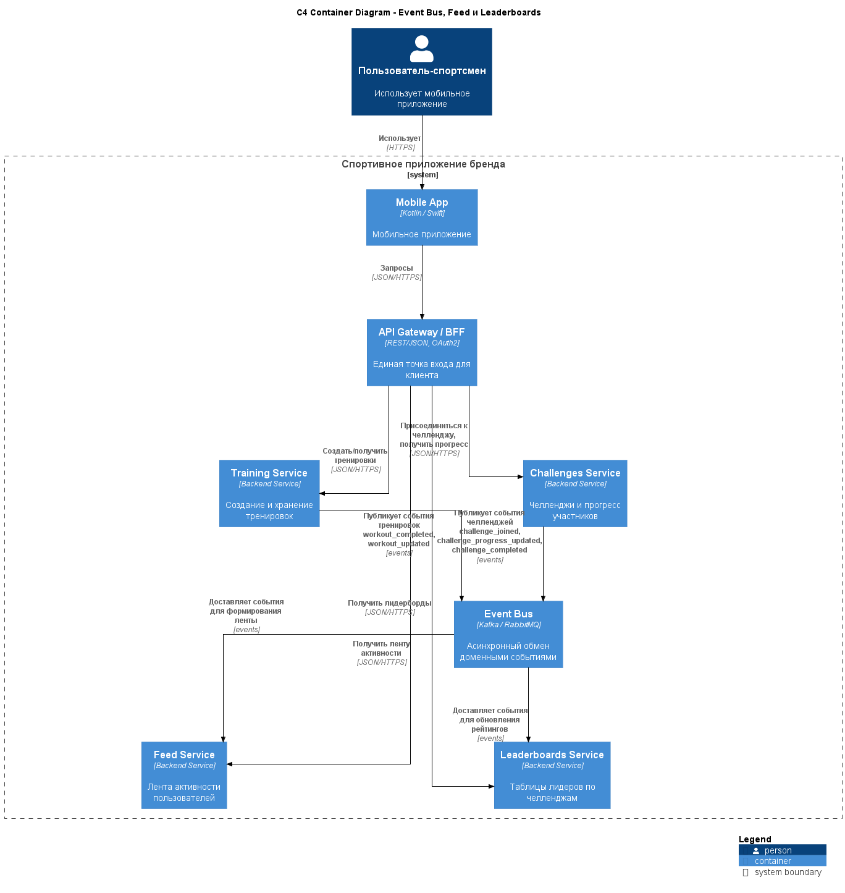

# ADR-006: Event-driven лента активности и лидерборды

---

## Context

Лента активности (Feed) и лидерборды (Challenges & Leaderboards) должны отображать:

- завершённые тренировки пользователей;  
- достижения и персональные рекорды;  
- участие и прогресс в челленджах;  
- результаты корпоративных и массовых событий.

При этом:

- объём событий потенциально очень велик (каждая тренировка, каждое обновление челленджа, большое количество участников);  
- пользователи ожидают близкого к реальному времени обновления ленты и рейтингов, но не абсолютной мгновенной консистентности;  
- данные для ленты и лидербордов уже присутствуют в других доменах (Training, Challenges), и было бы неэффективно «вытаскивать» их каждый раз напрямую из транзакционных таблиц при построении экрана.

Нужно выбрать подход к построению ленты и рейтинг‑таблиц:

- считать всё «на лету» по исходным данным;  
- материализовать представления и агрегаты на основе событий.

---

## Decision

Принято решение:

- Строить ленту активности (Feed) и лидерборды (Challenges & Leaderboards) **на основе событий**, публикуемых другими доменами в шину сообщений (Event Bus).  

- Основные источники событий:  
  - `Training Service`:  
    - `workout_completed`, `workout_updated`;  
  - `Challenges Service`:  
    - `challenge_created`, `challenge_joined`, `challenge_progress_updated`, `challenge_completed`;  
  - (опционально) `Plans`, `Commerce`, `Integrations` — для расширения ленты.

- Основные подписчики:  
  - `Feed & Activity Service`:  
    - формирует и обновляет ленту на основе событий;  
  - `Challenges & Leaderboards`:  
    - обновляет агрегаты по участникам и формирует таблицы лидеров;  
  - `Notifications`:  
    - генерирует уведомления на события (достижения, завершение челленджей).

Таким образом:

- домены Training и Challenges публикуют факты в Event Bus;  
- Feed и Leaderboards имеют собственные таблицы/хранилища с материализованными представлениями, оптимизированными под чтение.

---

## Status

- **Accepted** как целевой подход для реализации ленты и лидербордов.  
- Может быть дополнен локальными оптимизациями (кэши, дополнительные индексы) по мере роста нагрузки.

---

## Consequences

### Положительные

- **Масштабируемость и производительность:**

  - Чтение ленты и лидербордов идёт из собственных, заранее подготовленных структур (materialized views), а не через тяжёлые запросы к «сырым» тренировочным данным.  
  - Возможность горизонтально масштабировать Feed и Challenges независимо от Training.

- **Гибкость подключения новых потребителей:**

  - Любой новый сервис (аналитика, рекомендации, дополнительные уведомления) может подписаться на события без изменений в источниках.

- **Ясная модель источников и представлений:**

  - Training и Challenges остаются источниками истины для фактов;  
  - Feed и Leaderboards — специализированные проекции под чтение.

### Отрицательные

- **Eventual consistency:**

  - Между завершением тренировки и её появлением в ленте/рейтингах есть небольшая, но неизбежная задержка.  
  - Требуется учитывать это в UX (например, не обещать «мгновенного мира» и, при необходимости, показывать локально оптимистические обновления).

- **Сложность восстановления:**

  - При изменениях логики построения ленты или рейтингов может потребоваться реплей исторических событий для пересчёта проекций.  
  - Нужны механизмы обработки «отставших» или дублирующихся событий.

- **Дополнительное хранилище и код:**

  - Появляются отдельные схемы/таблицы под ленту и лидерборды, которые нужно проектировать, мигрировать и сопровождать.

---

## Alternatives considered

1. **Построение ленты и лидербордов «на лету» из исходных данных**

   - Плюсы:  
     - нет дублирования данных;  
     - проще модель (одна БД — одни таблицы).  
   - Минусы:  
     - тяжёлые запросы (JOIN’ы, агрегаты) по большим объёмам данных;  
     - плохая масштабируемость при росте числа пользователей и событий;  
     - высокий риск деградации производительности при пиках.  
   - Отклонено: не соответствует требованиям по производительности и масштабируемости.

2. **Синхронные обновления ленты и рейтингов средствами Training/Challenges**

   - Плюсы:  
     - «прямое» обновление, проще логика в начале.  
   - Минусы:  
     - сильная связанность: Training и Challenges должны знать детали хранения Feed/Leaderboards;  
     - повышение латентности операций создания/обновления тренировок;  
     - риск блокировок и ошибок при отказах Feed/Leaderboards.  
   - Отклонено: нарушает принцип слабой связанности и ухудшает UX по времени отклика базовых операций.

---

## Links to diagrams

- **[C4 Container Diagram (Event Bus, Feed и Leaderboards)](../assets/schemas/arch_schema_c4_leaderboards.puml)**  

 

[Назад](../../README.md)
