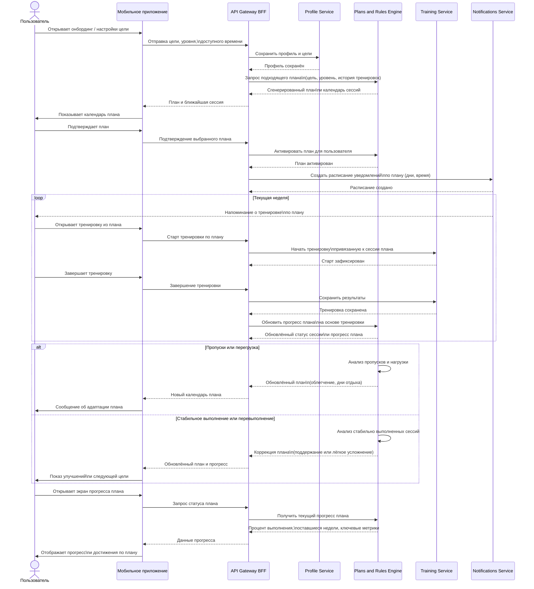
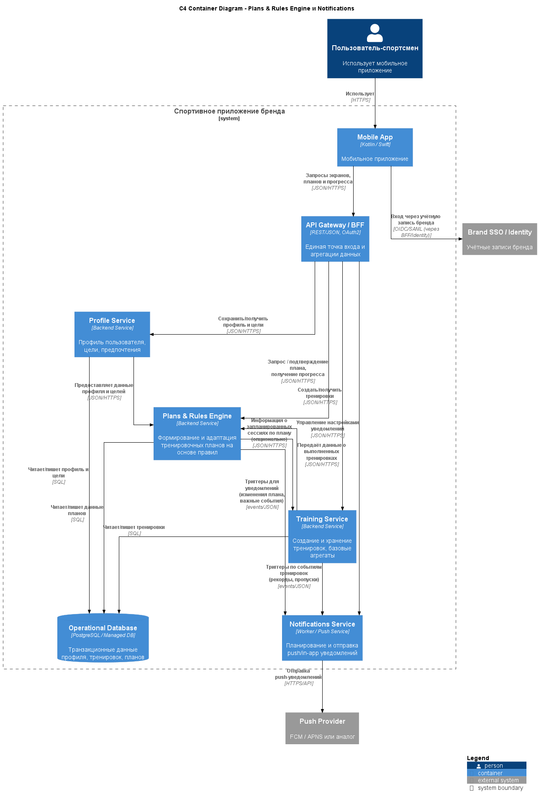

# ADR-007: Rules-based персонализация тренировочных планов и мотивации на первом этапе

---

## Context

Система должна:

- предлагать пользователю персональные тренировочные планы (под цели, уровень, доступное время);  
- адаптировать планы в зависимости от фактического выполнения (пропуски, перевыполнение, нагрузка);  
- отправлять мотивирующие уведомления (напоминания, поздравления, рекомендации) в «умный» момент.

Есть два основных подхода:

- сразу строить сложный ML‑/AI‑движок для персонализации;  
- начать с правил (rules‑based), постепенно усложняя модель по мере накопления данных.

Требования:

- быстро вывести MVP с работающей персонализацией;  
- иметь понятное и объяснимое поведение для пользователей и бизнеса;  
- не перегружать архитектуру и процессы MLOps на старте.

---

## Decision

Принято решение:

- Реализовать **персонализацию на первом этапе на основе правил (rules‑based)**, в виде отдельного сервиса **Training Plans & Rules Engine**, который:  
  - принимает на вход профиль пользователя (цели, уровень, доступное время, история тренировок);  
  - выбирает подходящий шаблон плана и адаптирует его по набору правил;  
  - при изменении фактического выполнения (события от Training) корректирует план (облегчение, «догоняющие» тренировки, дни отдыха и т.п.).

- Сервис работает по явным правилам, описанным в конфигурации/коде, например:  
  - если пользователь пропустил N ключевых тренировок подряд → снизить нагрузку, добавить лёгкую сессию;  
  - если пользователь стабильно перевыполняет план → плавно повысить нагрузку;  
  - если общая нагрузка за неделю превысила лимит → рекомендовать восстановление.

- Сервис **Notifications & Motivation** использует события и данные от Rules Engine и Training для формирования push/in‑app‑уведомлений.

---

## Status

- **Accepted** как решение для первых релизов.  
- В дальнейшем сервис может быть расширен/дополнен ML‑моделями без изменения базовых контрактов (input/output).

---

## Consequences

### Положительные

- **Быстрый time‑to‑market:**

  - Правила относительно быстро реализуются и меняются;  
  - не требуется сразу строить полноценный MLOps‑контур.

- **Прозрачность и объяснимость:**

  - Поведение системы легко объяснить продукту и пользователям («если пропустил 2 тренировки, план смягчается»);  
  - проще отлаживать и проверять корректность.

- **Хороший фундамент для данных:**

  - Уже на первом этапе собираются данные о профилях, планах, выполнении и реакциях пользователей;  
  - эти данные можно использовать для обучения будущих ML‑моделей.

- **Изоляция домена персонализации:**

  - Rules Engine вынесен в отдельный сервис с чётким контрактом, что упрощает дальнейшую эволюцию (подмена реализации без изменения остальных сервисов).

### Отрицательные

- **Ограниченная гибкость и точность:**

  - Rules‑based подход хуже адаптируется к сложным паттернам поведения и контексту, чем ML‑модели;  
  - для разных сегментов пользователей может потребоваться всё больше правил, что приведёт к усложнению.

- **Риск «захардкоженной» логики:**

  - При отсутствии дисциплины правила могут быть реализованы как «ветвистый» код, сложный в сопровождении;  
  - необходимы либо декларативные правила (таблицы/конфиг), либо аккуратная структура сервисов.

- **Ограниченная персонализация по «тонким» сигналам:**

  - На старте меньше возможностей учитывать сложные корреляции (сон, стресс, типы нагрузок, внешние факторы).

---

## Alternatives considered

1. **Сразу ML‑/AI‑движок персонализации**

   - Плюсы:  
     - более гибкая и точная персонализация;  
     - возможность находить неожиданные паттерны и давать «умные» рекомендации.  
   - Минусы:  
     - высокий порог входа (инфраструктура для ML, MLOps, дата‑сайентисты);  
     - необходимость большого объёма качественных данных с самого старта;  
     - сложно объяснить поведение модели пользователям и бизнесу.  
   - Отклонено как первый шаг, возможно в будущем как развитие поверх rules‑based‑ядра.

2. **Без персонализации (только статические планы)**

   - Плюсы:  
     - минимальная сложность реализации.  
   - Минусы:  
     - низкая воспринимаемая «умность» приложения;  
     - слабая связка с бизнес‑целями по удержанию и формированию привычки.  
   - Отклонено: не соответствует продуктовой цели «умный персональный тренер».

---

## Links to diagrams

- **Sequence Diagram: создание и поддержание привычки через персональный план**  

- **[C4 Container Diagram (с выделенным Plans & Rules Engine и Notifications)](../assets/schemas/arch_schema_c4_plans.puml)**  

 

[Назад](../../README.md)