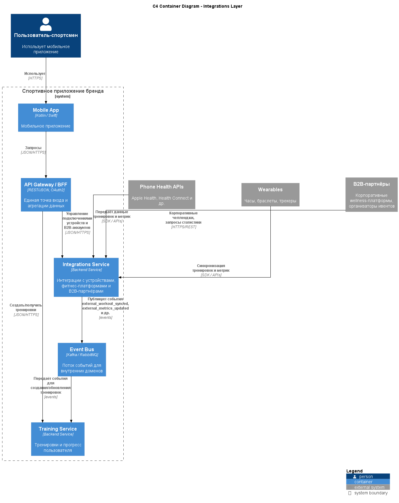

# ADR-008: Отдельный слой Integrations Service для устройств и B2B

---

## Context

Система должна интегрироваться:

- с фитнес‑функциями телефонов (Apple Health, Health Connect и аналоги);  
- с носимыми устройствами (часы, браслеты, трекеры разных брендов);  
- с B2B‑партнёрами (корпоративные wellness‑платформы, организаторы массовых мероприятий).

Особенности:

- у разных провайдеров — разные API, форматы данных, модели авторизации и ограничения (rate limits, политики приватности);  
- интерфейсы внешних систем подвержены изменениям, зависят от сторонних roadmap;  
- Training, Community, Plans и Commerce должны работать с унифицированной моделью данных (тренировки, метрики), а не со всеми вариациями внешних API;  
- B2B‑сценарии (корпоративные челленджи, выгрузка агрегированной статистики) требуют отдельной авторизационной и бизнес‑логики.

Нужно решить, где размещать логику интеграций:

- в каждом доменном сервисе по отдельности;  
- в одном или нескольких специализированных сервисах интеграций.

---

## Decision

Принято решение:

- Реализовать **отдельный доменный сервис Integrations Service**, который:

  - предоставляет внутренние унифицированные API для:  
    - импорта тренировок и метрик от внешних фитнес‑платформ и устройств;  
    - экспорта агрегированных данных для B2B‑партнёров;  
    - управления подключениями/авторизациями внешних аккаунтов/устройств.

  - инкапсулирует:  
    - работу с внешними SDK/API (Apple Health, Health Connect, производители wearables);  
    - трансформацию внешних форматов в внутреннюю модель тренировок и метрик;  
    - специфику договоров и форматов B2B‑интеграций.

- Взаимодействие с другими доменами:

  - Integrations публикует события о новых/обновлённых тренировках и метриках в Event Bus;  
  - Training Service потребляет эти события и создаёт/обновляет записи тренировок;  
  - B2B‑сервисный функционал (часть Integrations) использует агрегированные данные (через API/Analytics/DWH), не обращаясь напрямую к «сырым» таблицам доменов.

---

## Status

- **Accepted** как целевой подход к работе с внешними устройствами и B2B‑партнёрами.  
- Может быть разделён на несколько под‑сервисов (например, Devices Integrations и B2B Integrations) при росте сложности.

---

## Consequences

### Положительные

- **Разделение ответственности:**

  - Доменные сервисы (Training, Community, Commerce, Plans) работают только с внутренней моделью, не знают о деталях внешних API.  
  - Все рискованные и изменчивые зависимости концентрируются в Integrations Service.

- **Упрощение эволюции и поддержки:**

  - При изменении внешних API или добавлении новых провайдеров изменения происходят только в Integrations, остальные домены не затрагиваются.  
  - Можно использовать разные технические решения внутри Integrations (кеши, очереди, специальные адаптеры) без изменения доменной логики.

- **Улучшение безопасности и контроля:**

  - Можно централизованно контролировать OAuth‑флоу, хранение внешних токенов, ограничения по частоте запросов, обработку ошибок и логирование интеграций.

- **Поддержка B2B‑сценариев:**

  - B2B‑логика (корпоративные челленджи, отчётность) сосредоточена в одном месте, работает через внутренние API и аналитический контур, а не напрямую через доменные БД.

### Отрицательные

- **Дополнительный слой и точка отказа:**

  - Integrations становится критичным компонентом для сценариев, связанных с устройствами и B2B; требуется обеспечить его надёжность и масштабируемость.

- **Сложность контрактов:**

  - Необходимо аккуратно спроектировать внутренние контракты: какие данные и в каком виде Integrations передаёт в Training/Analytics/B2B, чтобы не «протаскивать» наружу детали внешних API.

- **Удлинение цепочек вызовов:**

  - Для некоторых сценариев (например, мгновенный импорт тренировки) появляется дополнительный hop: устройство → Integrations → Event Bus → Training → App.

---

## Alternatives considered

1. **Интеграции вшиты в Training Service**

   - Плюсы:  
     - меньше сервисов, меньше hop’ов;  
     - Training сразу видит данные в нужном формате.  
   - Минусы:  
     - Training становится перегруженным: доменная логика + интеграционная логика;  
     - любое изменение внешних API требует изменений в Training;  
     - при добавлении B2B‑интеграций Training рискует превратиться в «god object».  
   - Отклонено: нарушает принципы разделения ответственности и усложняет сопровождение.

2. **Отдельные интеграции в каждом доменном сервисе**

   - Плюсы:  
     - каждая команда сама управляет своими интеграциями.  
   - Минусы:  
     - дублирование кода (например, работа с Apple Health/Health Connect в нескольких сервисах);  
     - сложнее централизованно управлять безопасностью, логированием и обновлениями SDK/API;  
     - риск несогласованных моделей данных.  
   - Отклонено: создаёт «зоопарк» интеграций и повышает совокупную сложность системы.

---

## Links to diagrams

- **[C4 Container Diagram (слой Integrations)](../assets/schemas/arch_schema_c4_integrations.puml)**  

 

[Назад](../../README.md)