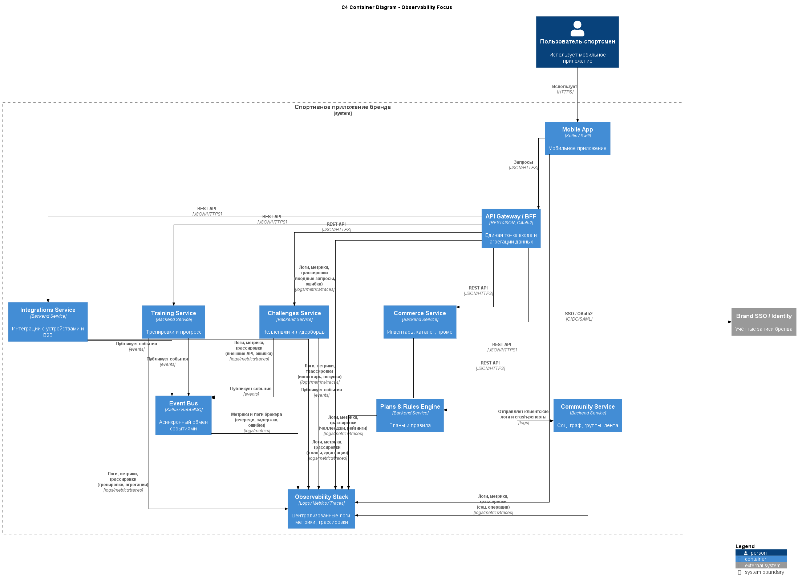

## ADR-009: Единый стек наблюдаемости (логи, метрики, трассировка)

***

## Context

Архитектура проекта распределённая: несколько доменных сервисов (Training, Community, Challenges, Plans, Commerce, Integrations, Identity), API Gateway/BFF, шина событий и внешние интеграции.

Для обеспечения SLA по доступности, производительности и надёжности, а также для быстрой диагностики инцидентов и продуктовой аналитики, требуется единый подход к наблюдаемости: логирование, метрики и распределённая трассировка.

***

## Decision

Принято решение:

- Внедрить **единый стек наблюдаемости** для всех сервисов, включающий:
    - централизованные структурированные логи;
    - технические и бизнес‑метрики;
    - распределённую трассировку запросов (end‑to‑end от Mobile App до backend‑сервисов и внешних систем).
- Ввести **обязательные требования**:
    - каждый сервис логирует ключевые события с trace‑/correlation‑ID;
    - каждый публичный API экспортирует базовые метрики (RPS, latency p95/p99, error rate);
    - все межсервисные вызовы прокидывают контекст трассировки.

***

## Status

- **Accepted** как базовый архитектурный принцип.
- Обязателен для всех новых сервисов; legacy‑компоненты подлежат постепенному переводу под общий стек.

***

## Consequences

### Положительные

- **Управляемость распределённой системы.** Проще локализовать проблемы по trace‑ID и метрикам, снижая MTTR.
- **Прозрачность качества сервиса.** Можно формулировать и контролировать SLO/SLA (латентность, доступность, ошибка интеграций, задержка обработки событий).
- **Поддержка продуктовой аналитики.** Бизнес‑метрики (созданные тренировки, участие в челленджах, конверсии в commerce) можно собирать вместе с техническими.

### Отрицательные

- **Инфраструктурные затраты.** Нужны ресурсы на развёртывание и поддержку стека наблюдаемости, хранение логов и метрик.
- **Сложность внедрения.** Требуется дисциплина команд, единые стандарты логирования и трассировки, доработка сервисов.

***

## Alternatives considered

1. **Минимальное логирование без метрик и трассировки.**
    - Плюсы: низкий порог входа, быстрое начало.
    - Минусы: сложно диагностировать распределённые проблемы, невозможно осмысленно управлять SLA.
2. **Разрозненные решения по наблюдаемости в каждой команде.**
    - Плюсы: гибкость для отдельных сервисов.
    - Минусы: отсутствие единой картины системы, сложность кросс‑сервисного анализа и поддержки 24/7.

***

## Links to diagrams

- **[C4 Container с показом, как все сервисы отправляют логи/метрики/трейсы в общий стек.](../assets/schemas/arch_schema_c4_logs.puml)**  

 

[Назад](../../README.md)