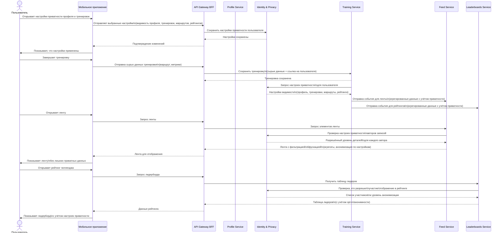
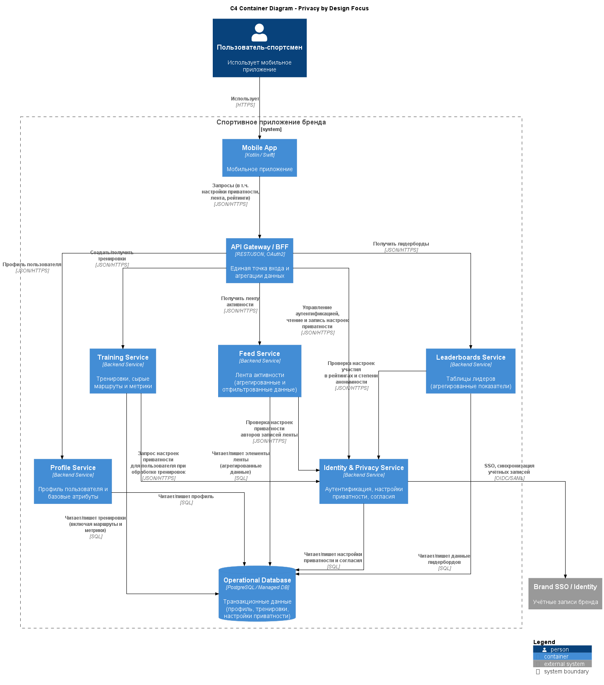

## ADR-010: Privacy by Design для social‑ и geo‑функций

***

## Context

Приложение активно использует:

- геоданные и маршруты тренировок;
- временные паттерны активности (когда и где человек бегает/ходит в зал);
- социальные функции (друзья, группы, челленджи, лидерборды);
- данные здоровья и производности (нагрузка, пульс, прогресс).

Исследования и инциденты с популярными фитнес‑приложениями показывают, что даже агрегированные и частично скрытые маршруты позволяют деанонимизировать места проживания/работы и чувствительные локации (военные базы, частные адреса и т.п.).  Простые «privacy zones» часто оказываются недостаточной защитой.

Нужно заранее встроить приватность в архитектуру и модель данных, а не добавлять её поверх.

***

## Decision

Принято решение:

- Применять **Privacy by Design** для всех social‑ и geo‑функций, в том числе:
    - хранить полные маршруты и детальные метрики **как приватные по умолчанию**, экспонируя наружу только агрегаты (дистанция, время, высота) там, где это возможно;
    - реализовать гибкие настройки приватности на уровне пользователя и каждой активности:
        - видимость профиля (публичный, только друзья, только я);
        - видимость тренировок (полная, только агрегаты, скрыто);
        - видимость маршрутов (карта целиком, усечённые/обфусцированные участки, полностью скрыта);
        - участие в глобальных рейтингах и публичных челленджах (опциональный opt‑in);
    - отдельные настройки для данных, показываемых в лидербордах и публичных списках:
        - возможность участия анонимно (ник/аватар без точных маршрутов и времени);
        - возможность скрыть конкретные показатели (например, вес, сердечный ритм).
- На уровне архитектуры:
    - явно разделить **сырые чувствительные данные** (geo, detailed metrics) и **публичные/полупубличные представления** (фиды, рейтинги, heatmap‑подобные визуализации);
    - в сервисах Feed и Leaderboards работать с агрегированными и минимизированными данными, учитывающими настройки приватности;
    - предусмотреть механизмы удаления/анонимизации данных по запросу пользователя (right to erasure / data export, если требуется).

***

## Status

- **Accepted** как обязательный принцип для проектирования всех функций, связанных с соц‑графом и геоданными.
- Должен учитываться при моделировании данных, API и UI‑флоу.

***

## Consequences

### Положительные

- **Снижение риска деанонимизации и физической угрозы.** Ограничение и контролируемая экспозиция геоданных уменьшает вероятность вычисления домашнего/рабочего адреса и маршрутов пользователей.
- **Большее доверие пользователей и соответствие ожиданиям.** Чёткие и понятные настройки приватности, по умолчанию более безопасные, повышают готовность делиться данными.
- **Соответствие регуляторным и этическим требованиям.** Проще соответствовать локальным законам и принципам обработки чувствительных данных здоровья и геолокации.

### Отрицательные

- **Усложнение реализации.** Нужно учитывать настройки приватности в каждом сценарии (лента, рейтинги, профили, экспорт данных) и в каждом сервисе, который читает эти данные.
- **Ограничение некоторых аналитических и social‑фич.** Менее детальные публичные данные и opt‑in‑модель участия в рейтингах уменьшают объём доступной для анализа и визуализаций информации.
- **Дополнительный UX‑слой.** Требуются продуманные UI‑флоу для объяснения настроек приватности и их влияния, иначе пользователи могут ошибочно считать данные защищёнными (как в кейсах с «Enhanced Privacy» в Strava).

***

## Alternatives considered

1. **Приватность только через «privacy zones» и простые флаги видимости маршрута**
    - Плюсы: минимальные изменения в архитектуре и модели данных.
    - Минусы: исследования показывают, что по даже частично скрытым маршрутам можно восстановить чувствительные локации; пользователи недооценивают риски.
    - Отклонено: недостаточная защита, особенно для чувствительных групп пользователей.
2. **Публичность по умолчанию с возможностью «запретить всё»**
    - Плюсы: максимум social‑данных для вовлечения и аналитики.
    - Минусы: высокая вероятность утечки приватной информации и негативной реакции при первых инцидентах; сложность согласования с регуляторами.
    - Отклонено: противоречит стратегии «privacy first».

***

## Links to diagrams

- **[C4 Container, где явно разделены](../assets/schemas/arch_schema_c4_privacy.puml)**  
  - хранение сырых маршрутов/метрик;
  - сервисы Feed/Leaderboards, работающие с агрегированными и анонимизированными данными;
  - настройки приватности в Identity/Profile.

 

[Назад](../../README.md)